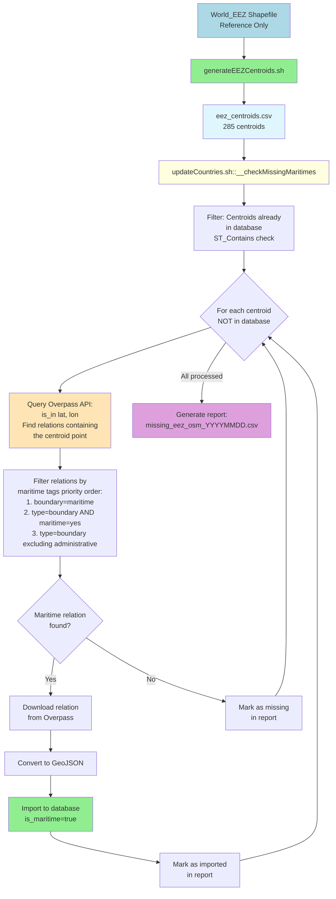

# Maritime Boundaries Verification

> **Note:** For general boundary processing, see [Process_Planet.md](./Process_Planet.md) and
> [bin/process/updateCountries.sh](../bin/process/updateCountries.sh).  
> For country boundary processing, see
> [Country_Assignment_2D_Grid.md](./Country_Assignment_2D_Grid.md).

## Overview

The maritime boundaries verification process identifies missing Exclusive Economic Zones (EEZ) and
other maritime boundaries in the database by comparing reference data from the World_EEZ shapefile
with OpenStreetMap (OSM) data.

**Key Principle:** The database contains **only OSM data**. The World_EEZ shapefile is used **only
as a reference** to identify what might be missing. Any boundaries found in OSM are automatically
imported into the database.

## Process Flow



## Components

### 1. EEZ Centroids Generation

**Script:** `bin/scripts/generateEEZCentroids.sh`

**Purpose:** Extracts centroid coordinates from the World_EEZ shapefile to create a reference list
of EEZ areas.

**Process:**

1. Extracts World_EEZ_v12_20231025.zip shapefile
2. Imports to temporary PostgreSQL table using `ogr2ogr`
3. Calculates centroids using PostGIS `ST_Centroid()`
4. Exports to CSV: `data/eez_analysis/eez_centroids.csv`

**Output Format:**

```csv
eez_id,name,territory,sovereign,centroid_lat,centroid_lon
3293,"Belgian Exclusive Economic Zone","Belgium","Belgium",51.463206,2.721323
```

**License:** The CSV is a derivative work of the World_EEZ shapefile and is licensed under CC-BY
4.0. See `data/eez_analysis/LICENSE` for full license details.

**Usage:**

```bash
# Generate centroids from shapefile
bash bin/scripts/generateEEZCentroids.sh

# With custom shapefile location
EEZ_SHAPEFILE=/path/to/World_EEZ_v12_20231025.zip bash bin/scripts/generateEEZCentroids.sh
```

### 2. Missing Maritimes Check

**Function:** `__checkMissingMaritimes()` in `bin/process/updateCountries.sh`

**When it runs:** Automatically at the end of `updateCountries.sh`, after processing standard
maritime boundaries.

**Process:**

#### Step 1: Load Centroids

- Reads `data/eez_analysis/eez_centroids.csv`
- Creates temporary database table `temp_eez_centroids`
- Loads all centroids with their metadata

#### Step 2: Filter Already Covered

- Checks which centroids are already covered by existing maritime boundaries in the database
- Uses `ST_Contains(c.geom, t.geom)` to verify coverage
- Only centroids NOT in database proceed to OSM check

#### Step 3: Query OSM for Missing Centroids

For each centroid NOT in the database:

1. **Overpass Query:**

   ```overpass
   [out:json][timeout:25];
   (
     is_in(lat,lon)["boundary"="maritime"];
     is_in(lat,lon)["type"="boundary"]["maritime"="yes"];
     is_in(lat,lon)["type"="boundary"]["boundary"];
   );
   out;
   ```

2. **Relation Filtering (Priority Order):**
   - **Priority 1:** `boundary=maritime` (explicit maritime boundary)
   - **Priority 2:** `type=boundary` AND `maritime=yes` (alternative maritime tag)
   - **Priority 3:** `type=boundary` (excluding `administrative` boundaries)

3. **Automatic Import:**
   - If a maritime relation is found, it is automatically downloaded and imported
   - Uses `__download_and_import_maritime_relation()` function
   - Marks the relation as `is_maritime=true` in the database
   - Status: `imported`

4. **Status Tracking:**
   - `imported`: Successfully found in OSM and imported
   - `covered_but_failed_import`: Found in OSM but import failed
   - `covered_no_relation_id`: Found in OSM but no valid relation ID extracted
   - `missing`: Not found in OSM
   - `query_failed`: Overpass query failed

#### Step 4: Generate Report

- Creates CSV report: `data/eez_analysis/missing_eez_osm_YYYYMMDD.csv`
- Contains all centroids with their status
- Optional: Sends email alert if new missing boundaries are found (if `ADMIN_EMAIL` is configured)

## Why This Approach?

### Standard Maritime Processing

The standard process downloads all relations with `boundary=maritime` tag:

```overpass
relation["boundary"="maritime"];
```

**Limitation:** This only finds boundaries explicitly tagged as `boundary=maritime`. Some maritime
boundaries in OSM may have different tags or may not be tagged at all.

### Centroid-Based Verification

The centroid-based approach:

1. **Uses Reference Data:** World_EEZ shapefile provides authoritative list of EEZ areas
2. **Spatial Search:** Uses `is_in(lat,lon)` to find ANY relation containing the centroid point
3. **Tag Filtering:** Filters results to prioritize maritime-related tags
4. **Automatic Import:** Automatically imports found relations, even if they don't have
   `boundary=maritime` tag

**Advantages:**

- Finds maritime boundaries with alternative tags
- Identifies truly missing boundaries (not in OSM at all)
- Automatically imports boundaries found in OSM
- Provides comprehensive coverage report

## Configuration

### Enable/Disable Check

The check is enabled by default. To disable:

```bash
# In etc/properties.sh
CHECK_MISSING_MARITIMES=false
```

### Email Alerts

To receive email alerts when new missing boundaries are found:

```bash
# In etc/properties.sh
ADMIN_EMAIL=admin@example.com
SEND_ALERT_EMAIL=true
```

## Output Files

### Centroids CSV

- **File:** `data/eez_analysis/eez_centroids.csv`
- **Format:** CSV with header
- **License:** CC-BY 4.0 (see `data/eez_analysis/LICENSE`)
- **Generated by:** `bin/scripts/generateEEZCentroids.sh`

### Verification Report

- **File:** `data/eez_analysis/missing_eez_osm_YYYYMMDD.csv`
- **Format:** CSV with status column
- **Columns:** `eez_id,name,territory,sovereign,centroid_lat,centroid_lon,status`
- **Generated by:** `__checkMissingMaritimes()` function

### Summary Report

- **File:** `data/eez_analysis/missing_eez_osm_report_YYYYMMDD.txt`
- **Format:** Text summary
- **Contains:** Statistics and summary of verification results

## Example Report

```csv
eez_id,name,territory,sovereign,centroid_lat,centroid_lon,status
23,"Amsterdam and Saint Paul Islands","France","France",-37.829167,77.558333,missing
27,"Crozet Islands","France","France",-46.416667,51.750000,missing
51,"Europa Island","France","France",-22.366667,40.366667,missing
5670,"Albanian Exclusive Economic Zone","Albania","Albania",40.927084,19.113001,imported
```

## Troubleshooting

### Centroids File Not Found

**Error:**

```text
EEZ centroids file not found: data/eez_analysis/eez_centroids.csv
```

**Solution:**

```bash
# Generate centroids from shapefile
bash bin/scripts/generateEEZCentroids.sh
```

### Overpass Query Timeout

**Symptom:** Many centroids marked as `query_failed`

**Solution:**

- Increase timeout in `__checkMissingMaritimes()` function
- Use different Overpass instance (set `OVERPASS_INTERPRETER` environment variable)
- Reduce number of concurrent queries (already sequential with 1-second delay)

### Import Failures

**Symptom:** Centroids marked as `covered_but_failed_import`

**Possible Causes:**

- Invalid geometry in OSM relation
- Relation is not a polygon/multipolygon
- Database connection issues

**Solution:**

- Check logs for specific error messages
- Verify relation geometry in OSM
- Check database connectivity and permissions

## Related Documentation

- **[Component_Dependencies.md](./Component_Dependencies.md)**: World_EEZ shapefile reference
- **[Process_Planet.md](./Process_Planet.md)**: General boundary processing
- **[Boundaries_Backup.md](./Boundaries_Backup.md)**: Maritime boundaries export
- **[bin/process/updateCountries.sh](../bin/process/updateCountries.sh)**: Implementation

## License

### OpenStreetMap Data

All maritime boundaries imported into the database from OSM are licensed under the **Open Database
License (ODbL)**. When using or distributing OSM data, proper attribution is required.

- **License:** [Open Database License (ODbL)](http://opendatacommons.org/licenses/odbl/)
- **Copyright:** [OpenStreetMap contributors](http://www.openstreetmap.org/copyright)
- **Attribution:** Required when using or distributing OSM data

For more information about OSM licensing, see:
[https://www.openstreetmap.org/copyright](https://www.openstreetmap.org/copyright)

### Reference Data (CC-BY 4.0)

The EEZ centroids CSV is a derivative work of the World_EEZ shapefile from MarineRegions.org and is
licensed under **Creative Commons Attribution 4.0 International (CC-BY 4.0)**.

**Source:** [MarineRegions.org Downloads](https://www.marineregions.org/downloads.php)  
**Original Dataset:** World EEZ v12 (2023-10-25)

See `data/eez_analysis/LICENSE` for full license details and attribution requirements.

**Note:** The shapefile and centroids CSV are used **only as reference** to identify missing
boundaries. The actual data in the database comes exclusively from OpenStreetMap.
