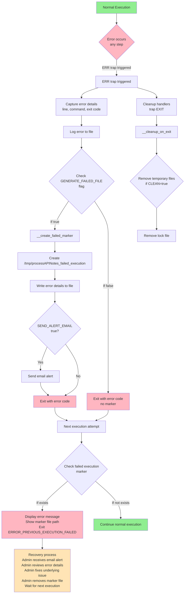
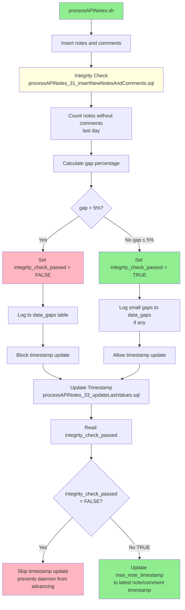
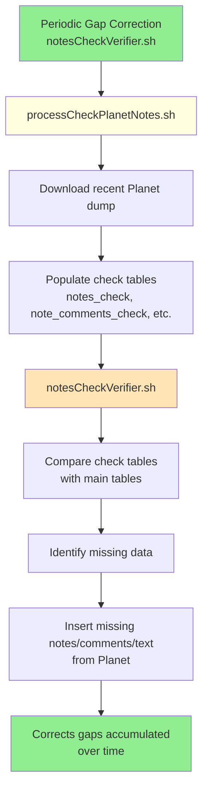
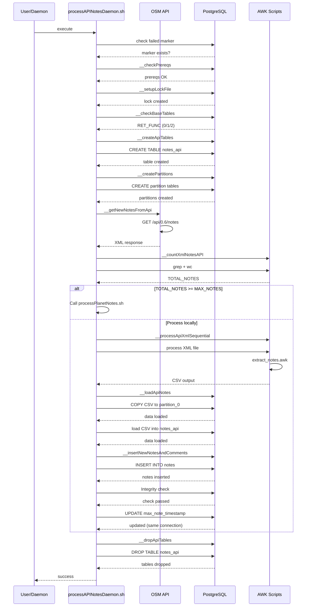
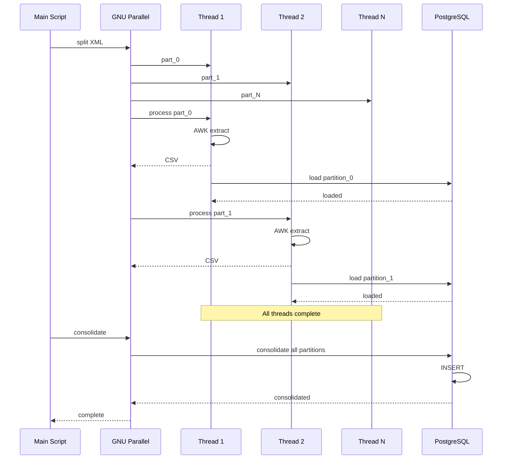

# Complete Description of processAPINotes.sh

> **Note:** For a general system overview, see [Documentation.md](./Documentation.md). For project
> motivation and background, see [Rationale.md](./Rationale.md).
>
> **⚠️ Recommended:** For production use, consider using `processAPINotesDaemon.sh` instead (see
> [Daemon Mode](#daemon-mode-processapinotesdaemonsh) section). The daemon provides lower latency
> (30-60 seconds vs 15 minutes) and better efficiency.

## General Purpose

The `processAPINotes.sh` script is the incremental synchronization component of the OpenStreetMap
notes processing system. Its main function is to download the most recent notes from the OSM API and
synchronize them with the local database that maintains the complete history.

> **Note:** This script can be run manually for testing, but for production environments, the daemon
> mode (`processAPINotesDaemon.sh`) is **REQUIRED**. The daemon provides better performance and
> lower latency than manual execution.

## Main Features

- **Incremental Processing**: Only downloads and processes new or modified notes
- **Intelligent Synchronization**: Automatically determines when to perform complete synchronization
  from Planet
- **Sequential Processing**: Efficient sequential processing optimized for incremental updates
- **Planet Integration**: Integrates with `processPlanetNotes.sh` when necessary

## Design Context

### Why This Design?

The API processing design was created to handle incremental updates efficiently while maintaining
data consistency with the complete Planet dataset. The key design decisions include:

**Separation of Concerns**:

- `processAPINotes.sh` and `processPlanetNotes.sh` are kept as independent scripts, even though they
  perform similar operations
- This separation allows each script to be optimized for its specific use case (incremental vs. bulk
  processing)
- Over time, shared library scripts were created to avoid code duplication while maintaining script
  independence

**Intelligent Synchronization Threshold**:

- When API returns >= 10,000 notes, the system automatically triggers Planet synchronization
- This prevents processing large API datasets inefficiently
- Leverages the proven Planet processing pipeline for better reliability

### Design Patterns Used

- **Singleton Pattern**: Ensures only one instance of `processAPINotes.sh` runs at a time (also used
  by the daemon)
- **Retry Pattern**: Implements exponential backoff for API calls and network operations
- **Circuit Breaker Pattern**: Prevents cascading failures when API is unavailable
- **Resource Management Pattern**: Uses `trap` handlers for cleanup of temporary files and resources

### Alternatives Considered

- **Single Script Approach**: Considered combining API and Planet processing into one script, but
  rejected to maintain separation of concerns and allow independent optimization
- **Partitioning Strategy**: Evaluated partitioning for API processing but chose sequential
  processing for simpler architecture and better suitability for incremental updates

### Trade-offs

- **Simplicity vs. Performance**: Sequential processing provides good performance for incremental
  updates while maintaining simplicity
- **Validation Speed**: Optional validations can be skipped (`SKIP_XML_VALIDATION`,
  `SKIP_CSV_VALIDATION`) for faster processing in production
- **Error Recovery**: Comprehensive error handling adds overhead but ensures system reliability and
  easier debugging

## Input Arguments

The script **does NOT accept arguments** for normal execution. It only accepts:

```bash
./processAPINotes.sh --help
# or
./processAPINotes.sh -h
```

**Why doesn't it accept arguments?**

- It is designed to run automatically (can be used with cron, but daemon mode is recommended)
- The decision logic is internal based on database state
- Configuration is done through environment variables

## Usage Examples

All examples below are verified against the actual codebase implementation.

### Basic Execution

```bash
# Standard execution (production mode)
cd /path/to/OSM-Notes-Ingestion
./bin/process/processAPINotes.sh
```

The script automatically:

- Creates temporary directories (location depends on installation mode)
- Downloads notes from OSM API
- Processes and synchronizes with the database
- Cleans up temporary files (if `CLEAN=true`)

**Log and Temporary File Locations:**

The system automatically detects installation mode:

- **Installed mode** (production):
  - Logs: `/var/log/osm-notes-ingestion/processing/processAPINotes.log`
  - Temporary files: `/var/tmp/osm-notes-ingestion/processAPINotes_XXXXXX/`
  - Lock files: `/var/run/osm-notes-ingestion/processAPINotes.lock`

- **Fallback mode** (testing/development):
  - Logs: `/tmp/osm-notes-ingestion/logs/processing/processAPINotes.log`
  - Temporary files: `/tmp/processAPINotes_XXXXXX/`
  - Lock files: `/tmp/osm-notes-ingestion/locks/processAPINotes.lock`

See [Installation_Guide.md](./Installation_Guide.md) for installation details.

### Environment Variable Configuration

#### Debug Mode

```bash
# Enable detailed logging
export LOG_LEVEL=DEBUG
./bin/process/processAPINotes.sh

# Enable trace-level logging (most verbose)
export LOG_LEVEL=TRACE
./bin/process/processAPINotes.sh
```

#### Validation Control

```bash
# Default behavior: Both XML and CSV validations are skipped by default (FASTER)
# SKIP_XML_VALIDATION=true by default
# SKIP_CSV_VALIDATION=true by default
# No need to export these for default behavior
./bin/process/processAPINotes.sh

# Enable strict validation (slower but more thorough)
export SKIP_XML_VALIDATION=false
export SKIP_CSV_VALIDATION=false
./bin/process/processAPINotes.sh
```

#### File Cleanup Control

```bash
# Keep temporary files for debugging
export CLEAN=false
export LOG_LEVEL=DEBUG
./bin/process/processAPINotes.sh

# Files will be preserved in temporary directory
# Installed: /var/tmp/osm-notes-ingestion/processAPINotes_XXXXXX/
# Fallback: /tmp/processAPINotes_XXXXXX/
# Useful for inspecting CSV files, logs, and intermediate data
```

#### Email Alerts

```bash
# Configure email alerts for failures
export ADMIN_EMAIL="admin@example.com"
export SEND_ALERT_EMAIL=true
export LOG_LEVEL=WARN
./bin/process/processAPINotes.sh

# Disable email alerts
export SEND_ALERT_EMAIL=false
./bin/process/processAPINotes.sh
```

#### Bash Debug Mode

```bash
# Enable bash debug mode (shows all commands executed)
export BASH_DEBUG=true
export LOG_LEVEL=TRACE
./bin/process/processAPINotes.sh
```

### Monitoring Execution

#### Finding Log Files

The system uses different log locations depending on installation mode. Use these helper functions:

```bash
# Function to find latest processAPINotes.log (works in both modes)
find_latest_processAPINotes_log() {
  find /var/log/osm-notes-ingestion/processing /tmp/osm-notes-ingestion/logs/processing \
    -name "processAPINotes.log" -type f -printf '%T@ %p\n' 2>/dev/null | \
    sort -n | tail -1 | awk '{print $2}'
}

# Function to find latest processAPINotesDaemon.log (works in both modes)
find_latest_daemon_log() {
  find /var/log/osm-notes-ingestion/daemon /tmp/osm-notes-ingestion/logs/daemon \
    -name "processAPINotesDaemon.log" -type f -printf '%T@ %p\n' 2>/dev/null | \
    sort -n | tail -1 | awk '{print $2}'
}

# Usage:
LATEST_LOG=$(find_latest_processAPINotes_log)
if [[ -n "${LATEST_LOG}" ]] && [[ -f "${LATEST_LOG}" ]]; then
  tail -f "${LATEST_LOG}"
fi
```

#### View Logs in Real-Time

```bash
# Find the latest log file (works in both installed and fallback modes)
LATEST_LOG=$(find /var/log/osm-notes-ingestion/processing /tmp/osm-notes-ingestion/logs/processing \
  -name "processAPINotes.log" -type f -printf '%T@ %p\n' 2>/dev/null | \
  sort -n | tail -1 | awk '{print $2}')

# Follow log output
if [[ -n "${LATEST_LOG}" ]] && [[ -f "${LATEST_LOG}" ]]; then
  tail -f "${LATEST_LOG}"
else
  echo "Log file not found. Check installation or use fallback mode."
fi

# Alternative: Direct path (if you know the mode)
# Installed mode:
tail -f /var/log/osm-notes-ingestion/processing/processAPINotes.log

# Fallback mode:
tail -f /tmp/osm-notes-ingestion/logs/processing/processAPINotes.log
```

#### Check Execution Status

```bash
# Check if script is running
ps aux | grep processAPINotes.sh

# Check lock file (contains PID and start time)
# Installed mode: /var/run/osm-notes-ingestion/processAPINotes.lock
# Fallback mode: /tmp/osm-notes-ingestion/locks/processAPINotes.lock
LOCK_FILE=$(find /var/run/osm-notes-ingestion /tmp/osm-notes-ingestion/locks \
  -name "processAPINotes.lock" 2>/dev/null | head -1)
if [[ -n "${LOCK_FILE}" ]]; then
  cat "${LOCK_FILE}"
fi

# Check for failed execution marker
# Location depends on installation mode
FAILED_FILE=$(find /var/run/osm-notes-ingestion /tmp/osm-notes-ingestion/locks \
  -name "processAPINotes_failed_execution" 2>/dev/null | head -1)
if [[ -n "${FAILED_FILE}" ]]; then
  ls -la "${FAILED_FILE}"
fi
```

### Error Recovery

#### Recovering from Failed Execution

**Automatic Recovery for Network Errors:**

The script now automatically recovers from temporary network errors:

- **Network errors** (connectivity issues, API timeouts): Do NOT create a failed execution marker
- **Auto-retry**: On next execution, the script verifies connectivity and continues automatically if
  restored
- **No manual intervention needed** for temporary network issues

**Manual Recovery for Data/Logic Errors:**

When a critical non-network error occurs (data corruption, logic errors), the script creates a
failed execution marker:

```bash
# 1. Check if previous execution failed
if [ -f /tmp/processAPINotes_failed_execution ]; then
    echo "Previous execution failed. Check email for details."
    cat /tmp/processAPINotes_failed_execution
fi

# 2. Review the latest log for error details
# Find latest log file (works in both modes)
LATEST_LOG=$(find /var/log/osm-notes-ingestion/processing /tmp/osm-notes-ingestion/logs/processing \
  -name "processAPINotes.log" -type f -printf '%T@ %p\n' 2>/dev/null | \
  sort -n | tail -1 | awk '{print $2}')
if [[ -n "${LATEST_LOG}" ]] && [[ -f "${LATEST_LOG}" ]]; then
  grep -i error "${LATEST_LOG}" | tail -20
fi

# 3. Fix the underlying issue (database, data corruption, etc.)

# 4. Remove the failed execution marker
rm /tmp/processAPINotes_failed_execution

# 5. Wait for next execution
# If using daemon mode: it will retry automatically
# If using cron: wait for next scheduled execution
# Manual execution should only be used for testing/debugging.
```

**Note:** Network errors are handled automatically and do not require manual intervention. Only data
corruption or logic errors require manual recovery.

#### Common Error Scenarios

**Historical data validation failure:**

```bash
# Error: Base tables missing or incomplete
# Solution: Run processPlanetNotes.sh first
./bin/process/processPlanetNotes.sh --base
```

**XML validation failure:**

```bash
# Error: Invalid XML structure from API
# Solution: Check API status
# Note: SKIP_XML_VALIDATION=true is already the default, so validation is skipped by default
# If you enabled validation (SKIP_XML_VALIDATION=false), you can revert to default:
unset SKIP_XML_VALIDATION
./bin/process/processAPINotes.sh
```

**Database connection failure:**

```bash
# Error: Cannot connect to database
# Solution: Check database is running and credentials in etc/properties.sh
# (created from etc/properties.sh.example)
psql -d notes -c "SELECT 1;"
```

**Network connectivity issues:**

```bash
# Error: Network connectivity check failed
# Error: API unreachable or download failed
# Diagnosis:
ping -c 3 api.openstreetmap.org
curl -I "https://api.openstreetmap.org/api/0.6/notes"

# Solution: Check internet connection, firewall, DNS
# The script implements retry logic with exponential backoff
# Wait for automatic retry or check network configuration
```

**No last update timestamp:**

```bash
# Error: No last update. Please load notes first.
# Diagnosis:
psql -d notes -c "SELECT * FROM max_note_timestamp;"

# Solution: Run processPlanetNotes.sh --base first to initialize database
./bin/process/processPlanetNotes.sh --base
```

**Planet process conflict:**

```bash
# Error: processPlanetNotes.sh is currently running
# Diagnosis:
ps aux | grep processPlanetNotes.sh
cat /tmp/processPlanetNotes.lock

# Solution: Wait for Planet process to complete, or if stuck:
# 1. Verify process is actually running
# 2. If not, remove stale lock: rm /tmp/processPlanetNotes.lock
```

**Large data gap detected:**

```bash
# Warning: Large gap detected (X notes), consider manual intervention
# Diagnosis:
LATEST_LOG=$(find /var/log/osm-notes-ingestion/processing /tmp/osm-notes-ingestion/logs/processing \
  -name "processAPINotes.log" -type f -printf '%T@ %p\n' 2>/dev/null | \
  sort -n | tail -1 | awk '{print $2}')
if [[ -n "${LATEST_LOG}" ]] && [[ -f "${LATEST_LOG}" ]]; then
  grep -i "gap" "${LATEST_LOG}"
fi

# Solution: Review gap details in logs
# If legitimate (e.g., API was down), script will continue
# If suspicious, may need to run processPlanetNotes.sh for full sync
```

# Solution:

# 1. Check memory: free -h

# 2. Reduce MAX_THREADS if memory constrained

# 3. Script will fall back to sequential processing if memory is low

export MAX_THREADS=2 ./bin/process/processAPINotes.sh

````

**CSV validation failures:**

```bash
# Error: CSV validation failed
# Diagnosis:
LATEST_LOG=$(find /var/log/osm-notes-ingestion/processing /tmp/osm-notes-ingestion/logs/processing \
  -name "processAPINotes.log" -type f -printf '%T@ %p\n' 2>/dev/null | \
  sort -n | tail -1 | awk '{print $2}')
if [[ -n "${LATEST_LOG}" ]] && [[ -f "${LATEST_LOG}" ]]; then
  grep -i "csv.*validation\|enum" "${LATEST_LOG}"
fi

# Solution:
# 1. Review validation errors in logs
# 2. Check if data format changed
# 3. Temporarily skip validation (not recommended):
export SKIP_CSV_VALIDATION=true
./bin/process/processAPINotes.sh
````

**Missing SQL files:**

```bash
# Error: SQL file validation failed
# Diagnosis:
ls -la sql/process/41_create_api_tables.sql
ls -la sql/process/42_create_partitions.sql

# Solution: Verify SQL files exist in sql/process/ directory
# Check repository is complete: git status
```

**Memory issues during processing:**

```bash
# Error: Low memory detected, using sequential processing
# Diagnosis:
free -h
dmesg | grep -i "killed\|oom"

# Solution:
# 1. Script automatically falls back to sequential processing
# 2. Free up system memory
# 3. Reduce MAX_THREADS if needed
export MAX_THREADS=1
./bin/process/processAPINotes.sh
```

**Lock file conflicts:**

```bash
# Error: Script is already running
# Diagnosis:
ps aux | grep processAPINotes.sh
# Find and display lock file (works in both modes)
LOCK_FILE=$(find /var/run/osm-notes-ingestion /tmp/osm-notes-ingestion/locks \
  -name "processAPINotes.lock" 2>/dev/null | head -1)
if [[ -n "${LOCK_FILE}" ]]; then
  cat "${LOCK_FILE}"
fi

# Solution:
# 1. If process is running, wait for completion
# 2. If process is not running, remove stale lock:
# Remove lock file (works in both modes)
LOCK_FILE=$(find /var/run/osm-notes-ingestion /tmp/osm-notes-ingestion/locks \
  -name "processAPINotes.lock" 2>/dev/null | head -1)
if [[ -n "${LOCK_FILE}" ]]; then
  rm "${LOCK_FILE}"
fi
```

**Failed execution marker present:**

```bash
# Error: Previous execution failed
# Diagnosis:
cat /tmp/processAPINotes_failed_execution

# Solution:
# 1. Review error details in marker file
# 2. Check email alert (if configured)
# 3. Review logs from failed execution
# 4. Fix underlying issue
# 5. Remove marker: rm /tmp/processAPINotes_failed_execution
# 6. Wait for next execution (if using cron) or let daemon retry automatically
```

### Error Handling and Recovery Sequence

The following diagram shows how errors are handled and recovered:



### Component Interaction Diagram

The following diagram shows how different components interact during processing:

```mermaid
graph TD
    MAIN[processAPINotes.sh]
    
    subgraph Functions["functionsProcess.sh"]
        FUNC1[__checkPrereqs]
        FUNC2[__checkBaseTables]
        FUNC3[__createBaseStructure]
    end
    
    subgraph APIFunctions["processAPIFunctions.sh"]
        API1[__getNewNotesFromApi]
        API2[__countXmlNotesAPI]
        API3[__processApiXmlSequential]
    end
    
    subgraph Validation["validationFunctions.sh"]
        VAL1[__validateApiNotesXMLFileComplete]
        VAL2[__validate_csv_structure]
        VAL3[__validate_csv_for_enum_compatibility]
    end
    
    subgraph ErrorHandling["errorHandlingFunctions.sh"]
        ERR1[__create_failed_marker]
        ERR2[__retry_* functions]
    end
    
    subgraph Common["commonFunctions.sh"]
        COMMON1[__log_* functions]
        COMMON2[__start_logger]
    end
    
    subgraph External["External Scripts"]
        PLANET[processPlanetNotes.sh<br/>if TOTAL_NOTES >= MAX_NOTES<br/>Full synchronization]
    end
    
    subgraph AWK["AWK Scripts"]
        AWK1[awk/extract_notes.awk]
        AWK2[awk/extract_comments.awk]
        AWK3[awk/extract_comment_texts.awk]
    end
    
    subgraph SQL["SQL Scripts"]
        SQL1[sql/process/processAPINotes_20_createApiTables.sql]
        SQL2[sql/process/processAPINotes_30_loadApiNotes.sql]
        SQL3[sql/process/processAPINotes_31_insertNewNotesAndComments.sql]
        SQL4[sql/process/processAPINotes_32_loadNewTextComments.sql]
    end
    
    MAIN -->|Calls| Functions
    MAIN -->|Calls| APIFunctions
    MAIN -->|Calls| Validation
    MAIN -->|Calls| ErrorHandling
    MAIN -->|Calls| Common
    MAIN -->|Calls if needed| PLANET
    MAIN -->|Executes| AWK
    MAIN -->|Executes| SQL
    
    style MAIN fill:#90EE90
    style Functions fill:#E0F6FF
    style APIFunctions fill:#E0F6FF
    style Validation fill:#FFFFE0
    style ErrorHandling fill:#FFB6C1
    style Common fill:#FFE4B5
    style PLANET fill:#DDA0DD
    style AWK fill:#ADD8E6
    style SQL fill:#F0E68C
```



### Automated Execution

> **⚠️ REQUIRED:** For production use, the daemon mode (`processAPINotesDaemon.sh`) is **REQUIRED**.
> See the [Daemon Mode](#daemon-mode-processapinotesdaemonsh) section for installation and
> configuration. The daemon provides 30-60 second latency vs 15 minutes with cron, and is the
> standard production deployment method.

**Important:** Do NOT add `processAPINotes.sh` to cron. The daemon mode replaces cron-based
execution for API notes processing. Cron is only used for maintenance and monitoring tasks (see
`examples/crontab-setup.example`).

**Note:** Scripts automatically create detailed logs in
`/tmp/processAPINotesDaemon_XXXXXX/processAPINotesDaemon.log` (daemon mode) or
`/tmp/processAPINotes_XXXXXX/processAPINotes.log` (manual execution).

### Database Inspection

#### Check Last Update Time

```bash
# Query the last update timestamp
psql -d notes -c "SELECT last_update FROM properties WHERE key = 'last_update_api';"
```

#### Check API Tables

```bash
# View notes in API tables (before sync)
psql -d notes -c "SELECT COUNT(*) FROM notes_api;"
psql -d notes -c "SELECT note_id, latitude, longitude, status FROM notes_api LIMIT 10;"
```

#### Check Processing Status

```bash
# Check if Planet sync was triggered
psql -d notes -c "SELECT * FROM properties WHERE key LIKE '%planet%';"
```

### Testing and Development

#### Development Mode

```bash
# Use test database
export DBNAME=osm_notes_test

# Enable all logging and validation
export LOG_LEVEL=TRACE
export SKIP_XML_VALIDATION=false
export SKIP_CSV_VALIDATION=false

# Keep files for inspection
export CLEAN=false

# Run script
./bin/process/processAPINotes.sh
```

#### Production Mode

```bash
# Minimal logging (errors only)
export LOG_LEVEL=ERROR

# Skip validation for speed (both XML and CSV validations are skipped by default)
# SKIP_XML_VALIDATION=true is the default, no need to export
# SKIP_CSV_VALIDATION=true is the default, no need to export
# Both validations are skipped by default for faster processing

# Clean up files (default: true)
export CLEAN=true

# Enable alerts
export SEND_ALERT_EMAIL=true
export ADMIN_EMAIL="admin@production.com"

# Run script
./bin/process/processAPINotes.sh
```

### Related Documentation

- **[bin/ENTRY_POINTS.md](../bin/Entry_Points.md)**: Entry point documentation
- **[bin/ENVIRONMENT_VARIABLES.md](../bin/Environment_Variables.md)**: Complete environment variable
  reference
- **[Documentation.md](./Documentation.md)**: System architecture and general usage examples

## Table Architecture

### API Tables (Temporary)

**IMPORTANT: Why API Tables Exist**

API tables are **critical** for the incremental synchronization process. They serve as an
intermediate staging area that allows the system to:

1. **Download complete note data** from the OSM API (including all historical comments)
2. **Filter and deduplicate** before inserting into base tables
3. **Avoid duplicate insertions** by checking what already exists in the database
4. **Provide diagnostic visibility** into what data was received vs. what was actually new

**Key Behavior: OSM API Returns Complete Note History**

When querying the OSM Notes API for a note, the API returns:

- **The note itself** (with current status)
- **ALL comments** associated with that note (not just new ones)

This means if a note has 10 comments and you query it, you'll receive all 10 comments, even if 9 of
them already exist in your database. The API tables store this complete data, and the insertion
process intelligently filters to only insert what's actually new.

**Understanding the Logs: What "Uploaded" vs "Inserted" Means**

When reviewing logs, you may see:

- `Uploaded new comments: 5` - This means 5 comments were loaded into `note_comments_api` from the
  API
- But only 1-2 comments might actually be inserted into `note_comments` table

**This is NORMAL and EXPECTED behavior.** The system is working correctly:

- Most comments already exist in the database (from previous API calls)
- Only truly new comments are inserted
- The API tables allow this filtering to happen efficiently

**Do not interpret this as a failure** - it's the system correctly avoiding duplicates.

API tables temporarily store data downloaded from the API:

- **`notes_api`**: Notes downloaded from the API
  - `note_id`: Unique OSM note ID
  - `latitude/longitude`: Geographic coordinates
  - `created_at`: Creation date
  - `status`: Status (open/closed)
  - `closed_at`: Closing date (if applicable)
  - `id_country`: ID of the country where it is located

- **`note_comments_api`**: Comments downloaded from the API
  - `id`: Generated sequential ID
  - `note_id`: Reference to the note
  - `sequence_action`: Comment order
  - `event`: Action type (open, comment, close, etc.)
  - `created_at`: Comment date
  - `id_user`: OSM user ID
  - `username`: OSM username

- **`note_comments_text_api`**: Comment text downloaded from the API
  - `id`: Comment ID
  - `note_id`: Reference to the note
  - `sequence_action`: Comment order
  - `body`: Textual content of the comment

#### Code Example: Creating and Using API Tables

The following example shows how API tables are created and used during processing:

```bash
# Source the API processing functions
source bin/lib/processAPIFunctions.sh

# Create API tables (called automatically by processAPINotes.sh)
__createApiTables

# Verify tables were created
psql -d "${DBNAME}" -c "SELECT
  schemaname,
  tablename,
  tableowner
FROM pg_tables
WHERE tablename LIKE 'notes_api%'
ORDER BY tablename;"

# Example: Load data into API tables (sequential processing)
__processApiXmlSequential "${XML_FILE}"
```

**SQL Example: API Table Structure**

```sql
-- Example API table structure
-- Created by: sql/process/processAPINotes_20_createApiTables.sql

CREATE TABLE IF NOT EXISTS notes_api (
  note_id INTEGER NOT NULL,
  latitude DECIMAL NOT NULL,
  longitude DECIMAL NOT NULL,
  created_at TIMESTAMP NOT NULL,
  closed_at TIMESTAMP,
  status note_status_enum,
  id_country INTEGER
);

-- Data is loaded directly into API tables using COPY command
-- No partitions are needed for sequential processing
```

### Base Tables (Permanent)

Uses the same base tables as `processPlanetNotes.sh`:

- `notes`, `note_comments`, `note_comments_text`

## Processing Flow

### Detailed Sequence Diagram

The following diagram shows the complete execution flow of `processAPINotes.sh`:

```mermaid
flowchart TD
    START[Manual/Daemon] --> MAIN[main starts]
    
    MAIN --> CHECK_HELP{Check --help<br/>parameter}
    CHECK_HELP -->|Help requested| EXIT_HELP[Exit]
    
    CHECK_HELP -->|Continue| CHECK_FAILED[Check failed execution marker<br/>Exit if previous execution failed]
    CHECK_FAILED --> CHECK_PREREQS[__checkPrereqs<br/>Verify commands available<br/>Verify database connection<br/>Verify SQL files exist]
    
    CHECK_PREREQS --> TRAP_ON[__trapOn<br/>Setup error handlers and cleanup]
    TRAP_ON --> SETUP_LOCK[__setupLockFile<br/>Check for existing lock<br/>Create lock file Singleton pattern<br/>Exit if already running]
    
    SETUP_LOCK --> DROP_API[__dropApiTables<br/>Remove temporary API tables]
    DROP_API --> CHECK_PLANET[__checkNoProcessPlanet<br/>Verify processPlanetNotes.sh not running]
    
    CHECK_PLANET --> CHECK_BASE[__checkBaseTables<br/>Check if base tables exist<br/>Return RET_FUNC 0=OK, 1=Missing, 2=Error]
    
    CHECK_BASE --> DECISION_RET{RET_FUNC<br/>value}
    
    DECISION_RET -->|RET_FUNC=1<br/>Tables missing| CREATE_BASE[__createBaseStructure<br/>Calls processPlanetNotes.sh --base]
    DECISION_RET -->|RET_FUNC=0<br/>Tables exist| VALIDATE_HIST[__validateHistoricalDataAndRecover<br/>Validates and recovers if needed]
    DECISION_RET -->|RET_FUNC=2<br/>Error| EXIT_ERROR[Create failed marker and exit]
    
    CREATE_BASE --> CREATE_API[__createApiTables<br/>Create temporary API tables]
    VALIDATE_HIST --> CREATE_API
    
    CREATE_API --> CREATE_PROP[__createPropertiesTable<br/>Create properties tracking table]
    CREATE_PROP --> ENSURE_COUNTRY[__ensureGetCountryFunction<br/>Ensure get_country function exists]
    ENSURE_COUNTRY --> CREATE_PROC[__createProcedures<br/>Create database procedures]
    
    CREATE_PROC --> GET_NOTES[__getNewNotesFromApi<br/>Get last update timestamp from DB<br/>Build OSM API URL<br/>Download XML from OSM API<br/>Save to API_NOTES_FILE]
    
    GET_NOTES --> VALIDATE_FILE[__validateApiNotesFile<br/>Check file exists<br/>Check file not empty]
    
    VALIDATE_FILE --> VALIDATE_PROCESS[__validateAndProcessApiXml]
    
    VALIDATE_PROCESS --> VALIDATE_XML{SKIP_XML_VALIDATION<br/>false?}
    VALIDATE_XML -->|Yes| VALIDATE_STRUCT[__validateApiNotesXMLFileComplete<br/>Validate XML structure]
    VALIDATE_XML -->|No| COUNT_NOTES[__countXmlNotesAPI<br/>Count notes in XML sets TOTAL_NOTES]
    VALIDATE_STRUCT --> COUNT_NOTES
    
    COUNT_NOTES --> DECISION_TOTAL{TOTAL_NOTES<br/>>= MAX_NOTES?}
    
    DECISION_TOTAL -->|YES| CALL_PLANET[Call processPlanetNotes.sh<br/>full sync]
    DECISION_TOTAL -->|NO| DECISION_PARALLEL{TOTAL_NOTES<br/>>= MIN_NOTES_FOR_PARALLEL?}
    
    DECISION_PARALLEL -->|YES| CHECK_MEM[__checkMemoryForProcessing<br/>Parallel processing]
    DECISION_PARALLEL -->|NO| SEQUENTIAL[__processApiXmlSequential<br/>AWK: XML → CSV<br/>Validate CSV structure<br/>Load to DB]
    
    CHECK_MEM --> SEQUENTIAL
    CALL_PLANET --> INSERT_NOTES[__insertNewNotesAndComments<br/>Insert notes and comments to base tables<br/>Validate data integrity integrity check<br/>Update last_update timestamp]
    
    SEQUENTIAL --> INSERT_NOTES
    
    INSERT_NOTES --> LOAD_TEXT[__loadApiTextComments<br/>Load comment text to base tables]
    LOAD_TEXT --> CHECK_GAPS[__check_and_log_gaps<br/>Check for data gaps and log]
    CHECK_GAPS --> CLEAN_FILES[__cleanNotesFiles<br/>Clean temporary files<br/>if CLEAN=true]
    CLEAN_FILES --> REMOVE_LOCK[Remove lock file]
    REMOVE_LOCK --> EXIT_SUCCESS[Exit successfully]
    
    style START fill:#90EE90
    style EXIT_SUCCESS fill:#90EE90
    style EXIT_HELP fill:#FFB6C1
    style EXIT_ERROR fill:#FFB6C1
    style CREATE_BASE fill:#FFFFE0
    style VALIDATE_HIST fill:#FFFFE0
    style CALL_PLANET fill:#FFE4B5
    style SEQUENTIAL fill:#E0F6FF
```



### Simplified Flow Steps

#### 1. Prerequisites Verification

- Verifies that `processPlanetNotes.sh` is not running
- Checks existence of base tables
- Validates necessary SQL files

#### 2. API Table Management

- Removes existing API tables
- Creates new API tables (no partitioning)
- Creates properties table for tracking

#### 3. Data Download

- Gets last update timestamp from database
- Builds API URL with filtering parameters
- Downloads new/modified notes from OSM API
- Validates downloaded XML structure

#### 4. Processing Decision

**If downloaded notes >= MAX_NOTES (configurable)**:

- Executes complete synchronization from Planet
- Calls `processPlanetNotes.sh`

**If downloaded notes < MAX_NOTES**:

- Processes downloaded notes locally
- Uses sequential processing

#### 5. Sequential Processing

- Processes XML file sequentially using AWK extraction
- Loads data directly into API tables
- Validates CSV structure before loading

### 6. Data Integration

- Inserts new notes and comments into base tables
- Processes in chunks if there is much data (>1000 notes)
- Validates data integrity (checks for notes without comments)
- Updates last update timestamp (executed in same connection as insertion to preserve integrity
  check result)
- Cleans temporary files

**Important: Understanding Insertion Behavior**

The insertion process (`__insertNewNotesAndComments`) performs intelligent bulk deduplication:

1. **For all notes in `notes_api`**: Performs bulk INSERT with automatic deduplication
   - Uses `ON CONFLICT` to handle existing notes (updates status/closed_at if changed)
   - Only performs country lookup for new notes (existing notes preserve their country)
   - All notes processed in a single bulk operation

2. **For all comments in `note_comments_api`**: Performs bulk INSERT with duplicate filtering
   - Uses `NOT EXISTS` to filter out comments that already exist before INSERT
   - Uses `ON CONFLICT` as a safety net for any remaining duplicates
   - All comments processed in a single bulk operation

**Why This Matters:**

Since the OSM API returns **all comments** for a note (not just new ones), you will frequently see:

- Many comments loaded into `note_comments_api` (e.g., "Uploaded new comments: 5")
- But only a few actually inserted (e.g., "Comments processing completed: 1 actually inserted, 4
  already existed")

**This is correct behavior** - the system is avoiding duplicates. The API tables enable this
filtering by allowing the system to:

- Load all data from the API first
- Then intelligently filter what's actually new
- Only insert what doesn't already exist

**Log Interpretation:**

When reviewing logs, look for messages like:

- `Lock validated. Starting bulk insertion of 3 notes` - Total notes being processed
- `Bulk notes insertion completed: 1 new notes, 2 updated` - Summary of bulk operation
- `Bulk comments insertion completed: 5 new comments inserted, 4 skipped (already exist)` - Summary
  of bulk operation

This shows the system is working correctly - it processes all data in bulk operations while
intelligently handling duplicates.

#### Code Example: Data Integration Process

The following example shows how API data is integrated into base tables:

```bash
# Source the API processing functions
source bin/lib/processAPIFunctions.sh

# Insert new notes and comments from API tables to base tables
# This uses bulk INSERT operations for optimal performance
# Note: This function also updates the timestamp automatically in the same
# database connection to ensure integrity check results persist
__insertNewNotesAndComments

# Verify the integration
psql -d "${DBNAME}" -c "
  SELECT
    COUNT(*) as total_notes,
    COUNT(*) FILTER (WHERE status = 'open') as open_notes,
    COUNT(*) FILTER (WHERE status = 'closed') as closed_notes
  FROM notes;
"
```

**SQL Bulk Insert Example:**

The `__insertNewNotesAndComments()` function uses bulk INSERT operations for optimal performance:

```sql
-- Example bulk insertion used by __insertNewNotesAndComments()
-- Located in: sql/process/processAPINotes_31_insertNewNotesAndComments.sql

-- Insert notes with country lookup for new notes only
WITH notes_with_countries AS (
  SELECT
    na.note_id,
    na.latitude,
    na.longitude,
    na.created_at,
    na.closed_at,
    na.status,
    -- Only lookup country for notes that don't exist yet
    CASE
      WHEN n.note_id IS NULL THEN get_country(na.longitude, na.latitude, na.note_id)
      ELSE n.id_country  -- Preserve existing country
    END as id_country
  FROM notes_api na
  LEFT JOIN notes n ON n.note_id = na.note_id
)
INSERT INTO notes (
  note_id, latitude, longitude, created_at, closed_at, status, id_country
)
SELECT
  note_id, latitude, longitude, created_at, closed_at, status, id_country
FROM notes_with_countries
ON CONFLICT (note_id) DO UPDATE SET
  status = EXCLUDED.status,
  closed_at = COALESCE(EXCLUDED.closed_at, notes.closed_at),
  id_country = COALESCE(EXCLUDED.id_country, notes.id_country);

-- Insert comments (skip existing ones using NOT EXISTS for efficiency)
INSERT INTO note_comments (
  id, note_id, sequence_action, event, created_at, id_user
)
SELECT
  nextval('note_comments_id_seq'),
  nca.note_id,
  nca.sequence_action,
  nca.event,
  nca.created_at,
  nca.id_user
FROM note_comments_api nca
WHERE NOT EXISTS (
  -- Skip comments that already exist
  SELECT 1 FROM note_comments nc
  WHERE nc.note_id = nca.note_id
    AND (nca.sequence_action IS NULL OR nc.sequence_action = nca.sequence_action)
)
ON CONFLICT (note_id, sequence_action) DO NOTHING;
```

### 7. Data Integrity Check and Gap Management

The API processing system includes a comprehensive data integrity validation mechanism to ensure
data consistency and detect potential issues during incremental synchronization.

#### What is the Integrity Check?

The integrity check (`app.integrity_check_passed`) is a PostgreSQL session variable that validates
whether the data insertion process completed successfully. Specifically, it verifies that notes have
their associated comments properly inserted.

**Purpose:**

- **Detect insertion failures**: Identifies cases where notes were inserted but their comments
  failed to insert
- **Prevent data inconsistency**: Blocks timestamp updates when data integrity is compromised
- **Alert on data gaps**: Logs gaps in the `data_gaps` table for monitoring and later correction

#### How the Integrity Check Works

The integrity check is performed in `processAPINotes_31_insertNewNotesAndComments.sql` after
inserting notes and comments:

1. **Count notes without comments**: Identifies notes from the last day that don't have any
   associated comments
2. **Calculate gap percentage**: Determines what percentage of notes lack comments
3. **Apply threshold**: If more than **5%** of notes lack comments, the check **fails**
4. **Set session variable**: Stores the result in `app.integrity_check_passed` (session-level
   persistence)
5. **Conditional timestamp update**: The `max_note_timestamp` is only updated if the integrity check
   passed

**Code Location:**

- Integrity check logic: `sql/process/processAPINotes_31_insertNewNotesAndComments.sql` (lines
  193-257)
- Timestamp update logic: `sql/process/processAPINotes_33_updateLastValues.sql` (lines 10-113)

#### Integrity Check Threshold: Why 5%?

The **5% threshold** is a balance between:

- **Tolerance for minor issues**: Small gaps (<5%) are acceptable and don't block processing
- **Detection of real problems**: Larger gaps (>5%) indicate systemic issues that need attention
- **Practical considerations**: Some notes may legitimately have no comments (e.g., immediately
  closed notes)

**Special Cases:**

- **Empty database**: If `total_comments_in_db = 0` (e.g., after data cleanup), the check is
  permissive and passes
- **No recent notes**: If there are no notes from the last day, the check passes (nothing to verify)

#### What Happens When the Check Fails?

When the integrity check fails (>5% of notes without comments):

1. **Timestamp update is blocked**: `max_note_timestamp` is **not updated**, preventing the daemon
   from advancing
2. **Gaps are logged**: Details are recorded in the `data_gaps` table:
   - Gap type: `notes_without_comments`
   - Gap count and percentage
   - List of affected `note_id`s (as JSON array)
   - Status: `processed = FALSE` (indicating it needs correction)
3. **Warnings are logged**: Messages are written to the `logs` table
4. **Processing continues**: The daemon will retry in the next cycle, potentially fixing transient
   issues

#### Small Gaps (<5%): Accepted but Tracked

Even when the integrity check **passes**, small gaps (<5%) may still exist. These are:

- **Logged to `data_gaps` table**: For monitoring and later correction
- **Not blocking**: Processing continues normally
- **Corrected later**: By `notesCheckVerifier.sh` (see below)

#### Gap Correction: notesCheckVerifier.sh

The `notesCheckVerifier.sh` script is responsible for correcting data gaps and problems that
accumulate over time from API calls. It works in conjunction with `processCheckPlanetNotes.sh`:

**Main purposes:**

1. **Correct problems from API calls**: Inserts missing notes/comments that were not captured by the
   API ingestion process
2. **Identify hidden notes**: Marks notes as hidden that exist in the system but not in Planet
   (these can only be detected by comparing with Planet dump)
3. **Data integrity**: Ensures the database matches the authoritative Planet dump

**How it works:**

1. **Download Planet dump**: `processCheckPlanetNotes.sh` downloads a recent Planet notes dump
2. **Populate check tables**: The Planet data is loaded into temporary check tables:
   - `notes_check`
   - `note_comments_check`
   - `note_comments_text_check`
3. **Compare with main tables**: `notesCheckVerifier.sh` identifies differences:
   - Notes/comments that exist in Planet but not in main tables (missing data from API)
   - Notes/comments that exist in main tables but not in Planet (hidden notes)
4. **Insert missing data**: Missing data from Planet is inserted into main tables:
   - Missing notes: `notesCheckVerifier_51_insertMissingNotes.sql`
   - Missing comments: `notesCheckVerifier_52_insertMissingComments.sql`
   - Missing text comments: `notesCheckVerifier_53_insertMissingTextComments.sql`
5. **Mark hidden notes**: Notes that exist in system but not in Planet are marked as hidden:
   - `notesCheckVerifier_54_markMissingNotesAsHidden.sql`

**Why this works:**

- **Planet dumps are authoritative**: They contain the complete, verified dataset
- **Periodic correction**: Running `notesCheckVerifier.sh` regularly (e.g., daily) corrects
  accumulated gaps from API calls
- **Hidden notes detection**: Only Planet dump comparison can identify notes that were hidden by the
  Data Working Group
- **Comprehensive coverage**: Compares all historical data (excluding today) to catch gaps from any
  period
- **Normal operation**: It's normal for this script to do nothing if tables are already correct - it
  only acts when differences are found

**Typical Usage:**

```bash
# Run daily via cron to correct accumulated gaps and identify hidden notes
0 6 * * * cd /path/to/OSM-Notes-Ingestion && EMAILS="your-email@example.com" ./bin/monitor/notesCheckVerifier.sh
```

#### Integrity Check Flow Diagram



**Periodic Gap Correction (notesCheckVerifier.sh)**



#### Session Variable Persistence

The `app.integrity_check_passed` variable must persist between the integrity check and the timestamp
update. This is achieved by:

1. **Session-level storage**: Using `set_config('app.integrity_check_passed', ..., true)` (the
   `true` parameter makes it session-level)
2. **Same connection execution**: Both SQL scripts are executed in the **same `psql` connection**
   within `__insertNewNotesAndComments()`:
   ```bash
   # Both scripts executed in single psql call
   cat > "${TEMP_SQL_FILE}" << EOF
   SET app.process_id = '${PROCESS_ID_INTEGER}';
   ${SQL_CMD}  # processAPINotes_31_insertNewNotesAndComments.sql
   EOF
   cat "${POSTGRES_34_UPDATE_LAST_VALUES}" >> "${TEMP_SQL_FILE}"  # processAPINotes_33_updateLastValues.sql
   psql -d "${DBNAME}" -f "${TEMP_SQL_FILE}"  # Single connection
   ```

**Why same connection?**

- PostgreSQL session variables persist across transactions **within the same connection**
- Each `psql` command creates a **new connection**, so separate calls would lose the variable
- Executing both scripts in one `psql` call ensures the variable is available to both

#### Monitoring Integrity Check Status

You can monitor the integrity check status by querying the database:

```sql
-- Check recent integrity check results from logs
SELECT message, processing
FROM logs
WHERE message LIKE '%Integrity check%'
ORDER BY processing DESC
LIMIT 10;

-- Check current gaps in data_gaps table
SELECT
  gap_type,
  gap_count,
  total_count,
  gap_percentage,
  processed,
  error_details
FROM data_gaps
WHERE processed = FALSE
ORDER BY gap_percentage DESC;

-- Check notes without comments (last day)
SELECT COUNT(DISTINCT n.note_id) as notes_without_comments
FROM notes n
LEFT JOIN note_comments nc ON nc.note_id = n.note_id
WHERE n.created_at > (SELECT timestamp FROM max_note_timestamp) - INTERVAL '1 day'
  AND nc.note_id IS NULL;
```

## Detailed Sequence Diagrams

### API Processing Sequence Diagram

The following diagram shows the detailed sequence of interactions between components during API
processing:



### Parallel Processing Sequence Diagram

The following diagram shows how parallel processing coordinates multiple threads:



## Integration with Planet Processing

### When Complete Synchronization is Required

When the number of notes downloaded from the API exceeds the configured threshold (MAX_NOTES), the
script triggers a complete synchronization from Planet:

1. **Stops API Processing**: Halts current API processing
2. **Calls Planet Script**: Executes `processPlanetNotes.sh --base`
3. **Resets API State**: Clears API processing state
4. **Resumes API Processing**: Continues with incremental updates

### Benefits of This Approach

- **Data Consistency**: Ensures complete data synchronization
- **Performance**: Avoids processing large API datasets
- **Reliability**: Uses proven Planet processing pipeline
- **Efficiency**: Leverages existing Planet infrastructure

## Configuration

### Environment Variables

The script uses several environment variables for configuration:

- **`MAX_NOTES`**: Threshold for triggering Planet synchronization
- **`API_TIMEOUT`**: Timeout for API requests
- **`PARALLEL_THREADS`**: Number of parallel processing threads
- **`CHUNK_SIZE`**: Size of data chunks for processing

### Database Configuration

- **`DBNAME`**: Database name for notes storage
- **`DB_USER`**: Database user for connections
- **`DB_PASSWORD`**: Database password for authentication
- **`DB_HOST`**: Database host address
- **`DB_PORT`**: Database port number

## Error Handling

### Common Error Scenarios

1. **API Unavailable**: Retries with exponential backoff
2. **Database Connection Issues**: Logs error and exits gracefully
3. **XML Parsing Errors**: Validates structure before processing
4. **Disk Space Issues**: Checks available space before processing

### Recovery Mechanisms

- **Automatic Retry**: Implements retry logic for transient failures
- **Graceful Degradation**: Continues processing with available data
- **Error Logging**: Comprehensive error logging for debugging
- **State Preservation**: Maintains processing state for recovery

### Signal and Trap Handling

The API processing uses refined trap management to ensure safe termination, consistent cleanup, and
clear error reporting when the process is interrupted or an unexpected error occurs.

- Trapped signals: `INT`, `TERM`, `ERR`.
- On trap:
  - Flushes and closes log sections properly.
  - Marks partial runs to enable recovery on next execution.
  - Cleans temporary directories when safe (`CLEAN=true`), preserving artifacts for debugging
    otherwise.
  - Exits with a non-zero error code aligned with the error category.

Operational guarantees:

- No orphan temporary directories when `CLEAN=true`.
- No silent exits; traps always log the call stack and failure reason.
- Compatible with parallel execution; each worker logs its own context.

## Performance Considerations

### Optimization Strategies

- **Bulk Operations**: Uses bulk INSERT operations instead of row-by-row processing for optimal
  performance
- **Lock Optimization**: Validates process lock once per batch instead of per record
- **Country Lookup Optimization**: Only performs country lookups for new notes (existing notes
  preserve their country)
- **Duplicate Filtering**: Uses efficient NOT EXISTS queries to filter duplicates before INSERT
  operations
- **Memory Management**: Efficient memory usage for large XML files
- **Database Optimization**: Uses optimized queries and indexes

### Monitoring Points

- **Processing Time**: Tracks time for each processing phase
- **Memory Usage**: Monitors memory consumption during processing
- **Database Performance**: Tracks database query performance
- **API Response Times**: Monitors API request response times

## Maintenance

### Regular Tasks

- **Log Rotation**: Manages log file sizes and rotation
- **Temporary File Cleanup**: Removes temporary files after processing
- **Database Maintenance**: Performs database optimization tasks
- **Configuration Updates**: Updates configuration as needed

### Troubleshooting

This section covers common issues specific to API processing. For a comprehensive troubleshooting
guide, see [Troubleshooting_Guide.md](./Troubleshooting_Guide.md).

#### Common API Processing Issues

**1. API Rate Limiting or Timeout**

**Symptoms:**

- Error: "API unreachable or download failed"
- Timeout errors during API calls
- Script fails during download phase

**Diagnosis:**

```bash
# Test API connectivity
curl -I "https://api.openstreetmap.org/api/0.6/notes"

# Check network connectivity
ping -c 3 api.openstreetmap.org

# Review download logs
LATEST_LOG=$(find /var/log/osm-notes-ingestion/processing /tmp/osm-notes-ingestion/logs/processing \
  -name "processAPINotes.log" -type f -printf '%T@ %p\n' 2>/dev/null | \
  sort -n | tail -1 | awk '{print $2}')
if [[ -n "${LATEST_LOG}" ]] && [[ -f "${LATEST_LOG}" ]]; then
  grep -i "api\|download\|timeout" "${LATEST_LOG}" | tail -20
fi
```

**Solutions:**

- **Automatic Recovery**: Network errors are handled automatically - no manual intervention needed
- The script will automatically retry on the next execution when connectivity is restored
- Check internet connectivity: `ping -c 3 api.openstreetmap.org`
- Verify OSM API is operational: https://www.openstreetmap.org/api/status
- The script implements automatic retry with exponential backoff (5 attempts)
- **Note**: Network errors do NOT create a failed execution marker, allowing automatic recovery

**2. Base Tables Missing**

**Symptoms:**

- Error: "Base tables missing or incomplete"
- Script exits with error code 238
- Failed execution marker created

**Diagnosis:**

```bash
# Check if base tables exist
psql -d "${DBNAME:-notes}" -c "
  SELECT table_name
  FROM information_schema.tables
  WHERE table_schema = 'public'
    AND table_name IN ('notes', 'note_comments', 'countries');
"

# Check failed execution marker
cat /tmp/processAPINotes_failed_execution
```

**Solutions:**

- Run initial Planet processing to create base tables:
  ```bash
  ./bin/process/processPlanetNotes.sh --base
  ```
- This will download and process historical data (takes 1-2 hours)
- After completion, API processing will work normally

**3. Large Data Gap Detected**

**Symptoms:**

- Warning: "Large gap detected (X notes), consider manual intervention"
- Script continues but logs warning
- May indicate API was down for extended period

**Diagnosis:**

```bash
# Review gap details in logs
LATEST_LOG=$(find /var/log/osm-notes-ingestion/processing /tmp/osm-notes-ingestion/logs/processing \
  -name "processAPINotes.log" -type f -printf '%T@ %p\n' 2>/dev/null | \
  sort -n | tail -1 | awk '{print $2}')
if [[ -n "${LATEST_LOG}" ]] && [[ -f "${LATEST_LOG}" ]]; then
  grep -i "gap\|missing" "${LATEST_LOG}"
fi

# Check last update timestamp
psql -d "${DBNAME:-notes}" -c "
  SELECT * FROM properties WHERE key = 'last_update_api';
"
```

**Solutions:**

- If gap is legitimate (API was down), script will continue normally
- If gap is suspicious, consider running Planet sync:
  ```bash
  ./bin/process/processPlanetNotes.sh
  ```
- Review gap size: gaps < 10,000 notes are usually acceptable

**4. Parallel Processing Failures**

**Symptoms:**

- Error: "Parallel processing failed"
- Low memory warnings
- Script falls back to sequential processing

**Diagnosis:**

```bash
# Check memory usage
free -h

# Check system logs for OOM kills
dmesg | grep -i "killed\|oom"

# Review processing logs
LATEST_LOG=$(find /var/log/osm-notes-ingestion/processing /tmp/osm-notes-ingestion/logs/processing \
  -name "processAPINotes.log" -type f -printf '%T@ %p\n' 2>/dev/null | \
  sort -n | tail -1 | awk '{print $2}')
if [[ -n "${LATEST_LOG}" ]] && [[ -f "${LATEST_LOG}" ]]; then
  grep -i "parallel\|memory\|partition" "${LATEST_LOG}"
fi
```

**Solutions:**

- Reduce MAX_THREADS if memory constrained:
  ```bash
  export MAX_THREADS=2
  ./bin/process/processAPINotes.sh
  ```
- Script automatically falls back to sequential processing if memory is low
- Add swap space if needed: `sudo swapon --show`

**5. CSV Validation Failures**

**Symptoms:**

- Error: "CSV validation failed"
- Enum compatibility errors
- Script exits during validation phase

**Diagnosis:**

```bash
# Review validation errors
LATEST_LOG=$(find /var/log/osm-notes-ingestion/processing /tmp/osm-notes-ingestion/logs/processing \
  -name "processAPINotes.log" -type f -printf '%T@ %p\n' 2>/dev/null | \
  sort -n | tail -1 | awk '{print $2}')
if [[ -n "${LATEST_LOG}" ]] && [[ -f "${LATEST_LOG}" ]]; then
  grep -i "csv.*validation\|enum" "${LATEST_LOG}"
fi

# Check CSV files (if CLEAN=false)
LATEST_DIR=$(ls -1rtd /tmp/processAPINotes_* | tail -1)
head -5 "$LATEST_DIR"/*.csv
```

**Solutions:**

- Review validation errors in logs to identify specific issues
- Check if OSM data format changed (rare)
- Temporarily skip validation for debugging (not recommended for production):
  ```bash
  export SKIP_CSV_VALIDATION=true
  ./bin/process/processAPINotes.sh
  ```

**6. Planet Sync Triggered**

**Symptoms:**

- Message: "Starting full synchronization from Planet"
- Script calls processPlanetNotes.sh
- Processing takes much longer than usual

**Diagnosis:**

```bash
# Check why Planet sync was triggered
LATEST_LOG=$(find /var/log/osm-notes-ingestion/processing /tmp/osm-notes-ingestion/logs/processing \
  -name "processAPINotes.log" -type f -printf '%T@ %p\n' 2>/dev/null | \
  sort -n | tail -1 | awk '{print $2}')
if [[ -n "${LATEST_LOG}" ]] && [[ -f "${LATEST_LOG}" ]]; then
  grep -i "total_notes\|max_notes\|planet" "${LATEST_LOG}"
fi

# Check MAX_NOTES threshold
grep -i "MAX_NOTES" etc/properties.sh
```

**Solutions:**

- This is normal behavior when API returns >= 10,000 notes
- Planet sync ensures complete data consistency
- Wait for Planet processing to complete (may take 1-2 hours)
- After completion, API processing resumes normally

#### Quick Diagnostic Commands

```bash
# Check script execution status
ps aux | grep processAPINotes.sh

# View latest log in real-time
# Find and tail latest log (works in both modes)
LATEST_LOG=$(find /var/log/osm-notes-ingestion/processing /tmp/osm-notes-ingestion/logs/processing \
  -name "processAPINotes.log" -type f -printf '%T@ %p\n' 2>/dev/null | \
  sort -n | tail -1 | awk '{print $2}')
if [[ -n "${LATEST_LOG}" ]] && [[ -f "${LATEST_LOG}" ]]; then
  tail -f "${LATEST_LOG}"
fi

# Check for failed execution
# Find failed execution marker (works in both modes)
FAILED_FILE=$(find /var/run/osm-notes-ingestion /tmp/osm-notes-ingestion/locks \
  -name "processAPINotes_failed_execution" 2>/dev/null | head -1)
if [[ -n "${FAILED_FILE}" ]]; then
  ls -la "${FAILED_FILE}"
fi

# Verify database connection
psql -d "${DBNAME:-notes}" -c "SELECT COUNT(*) FROM notes;"

# Check last update time
psql -d "${DBNAME:-notes}" -c "
  SELECT * FROM properties WHERE key = 'last_update_api';
"
```

#### Getting More Help

- **Comprehensive Guide**: See [Troubleshooting_Guide.md](./Troubleshooting_Guide.md) for detailed
  troubleshooting across all components
- **Error Codes**: See
  [Troubleshooting_Guide.md#error-code-reference](./Troubleshooting_Guide.md#error-code-reference)
  for complete error code reference
- **Logs**: All logs are stored in `/tmp/processAPINotes_XXXXXX/processAPINotes.log`
- **System Documentation**: See [Documentation.md](./Documentation.md) for system architecture
  overview

## Daemon Mode: processAPINotesDaemon.sh (Recommended)

> **Status:** **Recommended for production** - Provides lower latency and better efficiency than
> cron-based execution

### Overview

`processAPINotesDaemon.sh` is the **recommended production solution**, replacing cron-based
execution of `processAPINotes.sh`. It provides the same functionality with significant improvements:

- **Lower Latency**: 30-60 seconds between checks (vs 15 minutes with cron)
- **Better Efficiency**: One-time setup instead of recreating structures each execution
- **Adaptive Sleep**: Adjusts wait time based on processing duration
- **Continuous Operation**: Runs indefinitely, automatically recovering from errors
- **Auto-Initialization**: Automatically detects empty database and triggers
  `processPlanetNotes.sh --base` for initial data load
- **Gap Detection**: Includes `__recover_from_gaps()` and `__check_and_log_gaps()` functions to
  detect data integrity issues (notes without comments)
- **Feature Parity**: Complete feature parity with `processAPINotes.sh` to prevent regressions

### Comparison: Cron Script vs Daemon

| Aspect               | processAPINotes.sh (Cron)   | processAPINotesDaemon.sh (Daemon) ⭐         |
| -------------------- | --------------------------- | -------------------------------------------- |
| **Status**           | Legacy/Alternative          | **Recommended for production**               |
| **Execution**        | Periodic (every 15 min)     | Continuous (loop)                            |
| **Latency**          | 15 minutes                  | 30-60 seconds                                |
| **Setup Overhead**   | Every execution (1.8-4.5s)  | Once at startup                              |
| **Table Management** | DROP + CREATE each time     | TRUNCATE (reuses structure)                  |
| **Error Recovery**   | Wait for next cron          | Immediate retry                              |
| **Memory Usage**     | 23-39 MB (normal operation) | 23-39 MB (normal operation)                  |
| **Use Case**         | Legacy systems, testing     | **Production, real-time systems, messaging** |

### Memory Usage

#### Normal Operation (API Processing)

The daemon has very low memory footprint during normal operation:

- **Typical Memory**: 23-39 MB
- **Peak Memory**: ~40 MB
- **CPU Usage**: Low (<1% average)
- **Cycle Duration**: 9-11 seconds per cycle

This is because normal API processing handles small incremental updates (typically <100 notes per
minute).

#### Planet Sync Operation

When the daemon triggers `processPlanetNotes.sh` (when `TOTAL_NOTES >= MAX_NOTES`), memory usage
increases significantly:

- **Peak Memory**: 6-7 GB (observed in production)
- **Duration**: 1-2 hours (depending on data volume)
- **Operations**:
  - Parallel processing of 50+ XML parts (6 concurrent threads)
  - Processing ~5 million notes
  - Geographic integrity verification (spatial queries on millions of records)
  - Database consolidation operations

**Note**: This high memory usage is **expected and normal** for Planet processing. The system is
designed to handle this, and the daemon automatically recovers to normal memory usage after Planet
sync completes.

**Recommendations**:

- Ensure system has at least 8 GB RAM available during Planet sync operations
- Monitor memory usage during Planet sync (it's normal to see 6-7 GB peak)
- Planet sync operations are infrequent (only triggered when >=10,000 notes accumulate)

**⚠️ Important:** Do NOT run both scripts simultaneously. They use the same database tables and will
conflict.

**Recommendation:** Use the daemon for all production deployments. The cron approach is only
recommended for legacy systems or when systemd is not available.

### Installation

#### Using systemd (Recommended)

1. **Copy service file:**

   ```bash
   sudo cp examples/systemd/osm-notes-ingestion-daemon.service /etc/systemd/system/
   ```

2. **Edit service file** (REQUIRED - adjust paths and user):

   ```bash
   sudo nano /etc/systemd/system/osm-notes-ingestion-daemon.service
   ```

   **Important:** Update these lines:
   - `User=notes` → Your production user (may be different from login user)
   - `Group=notes` → **OPTIONAL** - Comment out or remove if you get `status=216/GROUP` error.
     systemd will use the user's primary group automatically.
   - `WorkingDirectory=/home/notes/OSM-Notes-Ingestion` → Actual project path
   - `ExecStart=/home/notes/OSM-Notes-Ingestion/bin/process/processAPINotesDaemon.sh` → Actual
     script path
   - `Documentation=file:///home/notes/OSM-Notes-Ingestion/docs/Process_API.md` → Actual docs path

   **Note:** If you login as `angoca` but the process should run as `notes`, set `User=notes`. The
   `Group=` line is optional - if you get `status=216/GROUP` error, remove the `Group=` line and
   systemd will use the user's primary group automatically.

   **Troubleshooting:**

   **Error 217/USER (user not found):**
   - Verify user exists: `getent passwd notes`
   - Update `User=` in service file to an existing user

   **Error 216/GROUP (group not found):**
   - Remove the `Group=` line from the service file (systemd will use user's primary group
     automatically)
   - Or find primary group: `id -gn notes` and use that name

   **Error 127 (command not found):**
   - Make script executable:
     `sudo chmod +x /home/notes/OSM-Notes-Ingestion/bin/process/processAPINotesDaemon.sh`
   - Use explicit bash in ExecStart: `ExecStart=/bin/bash /path/to/processAPINotesDaemon.sh`
     (instead of relying on shebang)
   - Verify script runs manually:
     `sudo -u notes /home/notes/OSM-Notes-Ingestion/bin/process/processAPINotesDaemon.sh --help`
   - Check PATH is set in service file (should include `/usr/bin:/bin`)

3. **Enable and start:**

   ```bash
   sudo systemctl daemon-reload
   sudo systemctl enable osm-notes-ingestion-daemon
   sudo systemctl start osm-notes-ingestion-daemon
   ```

4. **Verify status:**
   ```bash
   sudo systemctl status osm-notes-ingestion-daemon
   sudo journalctl -u osm-notes-ingestion-daemon -f
   ```

### Configuration

#### Environment Variables

```bash
# Sleep interval between API checks (default: 60 seconds)
export DAEMON_SLEEP_INTERVAL=60

# Logging level
export LOG_LEVEL=INFO

# Clean temporary files after processing
export CLEAN=true
```

#### Adaptive Sleep Logic

The daemon implements intelligent sleep calculation:

- **No new notes**: Sleeps full interval (60s default)
- **Processing < interval**: Sleeps remaining time (60s - processing_time)
- **Processing ≥ interval**: Continues immediately (no sleep)

**Examples:**

- Processed in 25s → Sleeps 35s (maintains 60s interval)
- Processed in 80s → Sleeps 0s (continues immediately)
- No notes → Sleeps 60s

### Migration from Cron Script

#### Step 1: Stop Cron Job

```bash
# Edit crontab
crontab -e

# Comment or remove the line:
# */15 * * * * /path/to/OSM-Notes-Ingestion/bin/process/processAPINotes.sh >/dev/null 2>&1
```

**Verify cron is stopped:**

```bash
crontab -l | grep processAPINotes
# Should return nothing or show commented line
```

#### Step 2: Install systemd Service

```bash
# 1. Copy service file
sudo cp examples/systemd/osm-notes-ingestion-daemon.service /etc/systemd/system/

# 2. Edit service file (REQUIRED - adjust paths and user)
sudo nano /etc/systemd/system/osm-notes-ingestion-daemon.service
```

**Edit these lines in the service file:**

- `User=osmuser` → Change to your user
- `Group=osmuser` → Change to your group
- `WorkingDirectory=/path/to/OSM-Notes-Ingestion` → Change to actual path
- `ExecStart=/path/to/OSM-Notes-Ingestion/bin/process/processAPINotesDaemon.sh` → Change to actual
  path
- `Documentation=file:///path/to/OSM-Notes-Ingestion/docs/Process_API.md` → Change to actual path

**Optional:** Adjust environment variables:

- `LOG_LEVEL=INFO` (or DEBUG, WARN, ERROR)
- `DAEMON_SLEEP_INTERVAL=60` (seconds between checks)
- `CLEAN=true` (clean temporary files)

#### Step 3: Enable and Start Daemon

```bash
# Reload systemd
sudo systemctl daemon-reload

# Enable daemon (start on boot)
sudo systemctl enable osm-notes-ingestion-daemon

# Start daemon
sudo systemctl start osm-notes-ingestion-daemon
```

#### Step 4: Verify Installation

```bash
# Check service status
sudo systemctl status osm-notes-ingestion-daemon
# Should show: "Active: active (running)"

# View logs in real-time
sudo journalctl -u osm-notes-ingestion-daemon -f

# View last 50 lines
sudo journalctl -u osm-notes-ingestion-daemon -n 50
```

#### Step 5: Verify Data Processing

```bash
# Check that notes are being processed
psql -d "${DBNAME}" -c "
  SELECT COUNT(*), MAX(created_at)
  FROM notes
  WHERE created_at > NOW() - INTERVAL '1 hour';
"

# Check last processed timestamp
psql -d "${DBNAME}" -c "
  SELECT timestamp, NOW() - timestamp AS age
  FROM max_note_timestamp;
"
```

#### Migration Checklist

- [ ] Cron job removed/commented
- [ ] Service file copied and paths updated
- [ ] User/group set correctly in service file
- [ ] Daemon enabled and started
- [ ] Service status shows "active (running)"
- [ ] Logs show successful initialization
- [ ] Data is being processed (check database)
- [ ] No errors in logs

#### Common Issues

**Service Fails to Start:**

```bash
# Check service status
sudo systemctl status osm-notes-ingestion-daemon

# Check logs for errors
sudo journalctl -u osm-notes-ingestion-daemon -n 100

# Common causes:
# - Wrong path in ExecStart
# - Wrong user/group
# - Database not accessible
# - Missing properties.sh
```

**Daemon Exits Immediately:**

```bash
# Check if lock file exists (another instance running)
# Find and display daemon lock file (works in both modes)
LOCK_FILE=$(find /var/run/osm-notes-ingestion /tmp/osm-notes-ingestion/locks \
  -name "processAPINotesDaemon.lock" 2>/dev/null | head -1)
if [[ -n "${LOCK_FILE}" ]]; then
  ls -la "${LOCK_FILE}"
fi

# Check logs
sudo journalctl -u osm-notes-ingestion-daemon -n 50

# Verify database connection
psql -d "${DBNAME}" -c "SELECT 1;"
```

**No Data Processing:**

```bash
# Check if daemon is checking API
sudo journalctl -u osm-notes-ingestion-daemon | grep -i "check\|api\|notes"

# Verify API is accessible
curl -s -o /tmp/test.xml "https://api.openstreetmap.org/api/0.6/notes/search.xml?limit=1"

# Check last timestamp
psql -d "${DBNAME}" -c "SELECT * FROM max_note_timestamp;"
```

#### Rollback (If Needed)

If you need to go back to cron:

```bash
# Stop and disable daemon
sudo systemctl stop osm-notes-ingestion-daemon
sudo systemctl disable osm-notes-ingestion-daemon

# Remove service file
sudo rm /etc/systemd/system/osm-notes-ingestion-daemon.service
sudo systemctl daemon-reload

# Restore cron
crontab -e
# Add: */15 * * * * /path/to/OSM-Notes-Ingestion/bin/process/processAPINotes.sh >/dev/null 2>&1
```

### Testing

Run daemon-specific tests:

```bash
# Run all daemon tests
./tests/run_processAPINotesDaemon_tests.sh

# Or run specific test suites
bats tests/unit/bash/processAPINotesDaemon_sleep_logic.test.bats
bats tests/unit/bash/processAPINotesDaemon_integration.test.bats
```

### Logging

#### With systemd (Recommended)

When running with systemd, logs are integrated with `journalctl`:

```bash
# View logs in real-time
sudo journalctl -u osm-notes-ingestion-daemon -f

# View last 100 lines
sudo journalctl -u osm-notes-ingestion-daemon -n 100

# View logs since today
sudo journalctl -u osm-notes-ingestion-daemon --since today

# Filter by log level
sudo journalctl -u osm-notes-ingestion-daemon -p err
```

**Log location:** Systemd journal (not files)

#### Manual Execution

When running manually (not recommended for production), logs are written to:

```
/tmp/processAPINotesDaemon_XXXXXX/processAPINotesDaemon.log
```

Where `XXXXXX` is a random suffix. The directory persists for the daemon's lifetime.

**View logs:**

```bash
# Find latest log directory
LATEST_DIR=$(ls -1rtd /tmp/processAPINotesDaemon_* | tail -1)

# View logs
tail -f "${LATEST_DIR}/processAPINotesDaemon.log"

# Or use the one-liner from script header
# Find and tail latest daemon log (works in both modes)
LATEST_LOG=$(find /var/log/osm-notes-ingestion/daemon /tmp/osm-notes-ingestion/logs/daemon \
  -name "processAPINotesDaemon.log" -type f -printf '%T@ %p\n' 2>/dev/null | \
  sort -n | tail -1 | awk '{print $2}')
if [[ -n "${LATEST_LOG}" ]] && [[ -f "${LATEST_LOG}" ]]; then
  tail -40f "${LATEST_LOG}"
fi
```

**Log rotation:** Logs accumulate in the same file while daemon runs. For long-running daemons,
consider log rotation or use systemd.

### Troubleshooting

#### Daemon Not Starting

```bash
# Check service status
sudo systemctl status osm-notes-ingestion-daemon

# Check logs
sudo journalctl -u osm-notes-ingestion-daemon -n 100

# Verify lock file
# Find and display daemon lock file (works in both modes)
LOCK_FILE=$(find /var/run/osm-notes-ingestion /tmp/osm-notes-ingestion/locks \
  -name "processAPINotesDaemon.lock" 2>/dev/null | head -1)
if [[ -n "${LOCK_FILE}" ]]; then
  ls -la "${LOCK_FILE}"
fi
```

#### Daemon Stops Unexpectedly

The daemon exits after 5 consecutive errors. Check logs:

```bash
sudo journalctl -u osm-notes-ingestion-daemon | grep -i error
```

#### Daemon Fails After Planet Sync

If the daemon fails immediately after `processPlanetNotes.sh` completes successfully, it may be due
to API tables being dropped during Planet sync. This has been fixed in the code, but if you
encounter this issue:

**Symptoms:**

- Daemon fails with exit code 1 after Planet sync completes
- Error about missing tables (`notes_api`, `note_comments_api`, `note_comments_text_api`)

**Solution:**

- The daemon now checks if API tables exist before truncating them
- If tables don't exist (dropped by `processPlanetNotes.sh`), the daemon skips truncation
- Restart the daemon: `sudo systemctl restart osm-notes-ingestion-daemon`

#### Graceful Shutdown

```bash
# Stop daemon gracefully
sudo systemctl stop osm-notes-ingestion-daemon

# Or send shutdown signal
# Create shutdown flag (works in both modes)
SHUTDOWN_FLAG=$(find /var/run/osm-notes-ingestion /tmp/osm-notes-ingestion/locks \
  -name "processAPINotesDaemon_shutdown" 2>/dev/null | head -1)
if [[ -z "${SHUTDOWN_FLAG}" ]]; then
  # Use appropriate location based on installation
  if [[ -d "/var/run/osm-notes-ingestion" ]] && [[ -w "/var/run/osm-notes-ingestion" ]]; then
    touch /var/run/osm-notes-ingestion/processAPINotesDaemon_shutdown
  else
    touch /tmp/osm-notes-ingestion/locks/processAPINotesDaemon_shutdown
  fi
fi
```

### Files Reference

**Essential Files:**

- `bin/process/processAPINotesDaemon.sh` - Main daemon script
- `examples/systemd/osm-notes-ingestion-daemon.service` - systemd service file

**Dependencies** (already in repository):

- Same as `processAPINotes.sh`: `etc/properties.sh`, `lib/osm-common/`, SQL scripts, etc.

### Technical Details

- **Singleton Pattern**: Uses `flock` for atomic lock file management
- **Signal Handling**: SIGTERM/SIGINT (graceful shutdown), SIGHUP (reload config), SIGUSR1 (status)
- **Error Recovery**: Automatic retries with consecutive error limit (5)
- **Year Change**: Handles correctly (partitions are by `part_id`, not date)
- **Resource Management**: Automatic cleanup via `trap` handlers

## Related Documentation

- **System Overview**: See [Documentation.md](./Documentation.md) for general architecture
- **Planet Processing**: See [Process_Planet.md](./Process_Planet.md) for Planet data processing
  details
- **Project Background**: See [Rationale.md](./Rationale.md) for project motivation and goals
