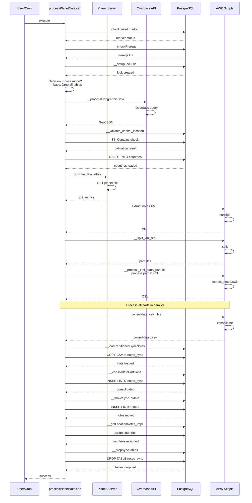

# Complete Description of processPlanetNotes.sh

> **Note:** For a general system overview, see [Documentation.md](./Documentation.md). For project
> motivation and background, see [Rationale.md](./Rationale.md).

## General Purpose

The `processPlanetNotes.sh` script is the central component of the OpenStreetMap notes processing
system. Its main function is to download, process, and load into a PostgreSQL database all notes
from the OSM planet, either from scratch or only new notes.

## Design Context

### Why This Design?

The Planet processing design was created to handle very large XML files (2.2GB+) efficiently while
maintaining data integrity. The key design decisions include:

**AWK-Based XML Processing**:

- XML files from Planet are simple in structure and repeat elements many times
- AWK processes XML as text files without full XML parsing, which is much faster
- This approach was chosen after evaluating Saxon (Java, memory issues), xmlproc (memory leaks), and
  xmlstarlet (uses xmlproc)
- **Trade-off**: Risk if OSM changes XML format, but API 0.6 has been stable for ~12 years

**Split-Process-Consolidate Approach**:

- Large XML files are split into parts first, then processed in parallel with AWK
- This prevents OOM (Out of Memory) kills with large text fields
- Each part is processed independently, then results are consolidated
- Better than trying to process the entire file at once

**Sync Tables Pattern**:

- Temporary sync tables allow parallel processing without affecting base tables
- Enables validation before committing to main tables
- Provides rollback capability in case of errors
- Allows deduplication before final insertion

**Parallel Processing Strategy**:

- Divides work into more parts than threads for better load balancing
- Prevents scenarios where one thread finishes quickly while another processes heavy workload
- Example: Old notes from backup have correct positions (fast), new notes need calculation (slow)
- By dividing into more parts, threads can balance workload from a common queue

### Design Patterns Used

- **Singleton Pattern**: Ensures only one instance of `processPlanetNotes.sh` runs at a time
- **FIFO Queue Pattern**: Used for downloading boundaries via Overpass API to prevent race
  conditions
- **Semaphore Pattern**: Limits concurrent downloads to Overpass API, preventing rate limiting and
  temporary bans
- **Retry Pattern**: Implements exponential backoff for download failures and network operations
- **Resource Management Pattern**: Uses `trap` handlers for cleanup of temporary files and resources

### Alternatives Considered

- **XSLT Processing**: Initially used Saxon and xsltproc, but both had memory limitations with large
  files
- **Full XML Parsing**: Considered using XML parsers, but AWK text processing proved much faster and
  more memory-efficient
- **Sequential Processing**: Considered processing files sequentially, but parallel processing
  significantly reduces total time
- **Fixed Partitions**: Evaluated fixed number of partitions, but dynamic partitioning based on data
  volume provides better resource utilization

### Trade-offs

- **Processing Speed vs. Memory**: AWK processing is faster but requires careful file splitting to
  avoid memory issues
- **Validation vs. Performance**: Optional XML/CSV validations can be skipped for faster processing
- **Parallel Complexity**: Parallel processing adds complexity but provides significant performance
  gains
- **Sync Tables Overhead**: Temporary tables add overhead but provide safety and validation
  capabilities

## Input Arguments

The script accepts two types of arguments:

### 1. No argument (incremental processing)

```bash
./processPlanetNotes.sh
```

- **Purpose**: Processes only new notes from the planet file
- **Behavior**:
  - Downloads the most recent planet file
  - Compares with existing notes in the database
  - Inserts only notes that don't exist
  - Updates comments and comment texts

### 2. `--base` argument (complete processing)

```bash
./processPlanetNotes.sh --base
```

- **Purpose**: Processes all notes from scratch
- **Behavior**:
  - Removes all existing tables
  - Downloads and processes country and maritime boundaries
  - Downloads the complete planet file
  - Processes all notes from the planet
  - Creates the complete database structure

## Table Architecture

### Base Tables (Permanent)

Base tables store the complete history of all notes:

- **`notes`**: Stores all notes from the planet
  - `note_id`: Unique OSM note ID
  - `latitude/longitude`: Geographic coordinates
  - `created_at`: Creation date
  - `status`: Status (open/closed)
  - `closed_at`: Closing date (if applicable)
  - `id_country`: ID of the country where it is located
  - `insert_time`: Timestamp when the note was inserted into the database (automatically set by
    trigger on INSERT)
  - `update_time`: Timestamp when the note was last updated in the database (automatically updated
    by trigger on UPDATE)

- **`note_comments`**: Comments associated with notes
  - `id`: Generated sequential ID
  - `note_id`: Reference to the note
  - `sequence_action`: Comment order
  - `event`: Action type (open, comment, close, etc.)
  - `created_at`: Comment date
  - `id_user`: OSM user ID

- **`note_comments_text`**: Comment text
  - `id`: Comment ID
  - `note_id`: Reference to the note
  - `sequence_action`: Comment order
  - `body`: Textual content of the comment

### Sync Tables (Temporary)

Sync tables are temporary and used for incremental processing:

- **`notes_sync`**: Temporary version of `notes`
- **`note_comments_sync`**: Temporary version of `note_comments`
- **`note_comments_text_sync`**: Temporary version of `note_comments_text`

**Why do sync tables exist?**

1. **Parallel Processing**: Allow processing large volumes of data in parallel
2. **Validation**: Allow verifying integrity before moving to main tables
3. **Rollback**: In case of error, it's easier to revert changes in temporary tables
4. **Deduplication**: Allow removing duplicates before final insertion

#### Code Example: Sync Table Operations

The following example shows how sync tables are used during Planet processing:

```bash
# Source the Planet processing functions
source bin/lib/processPlanetFunctions.sh

# Create sync tables (called automatically by processPlanetNotes.sh)
__createSyncTables

# Create partitions for parallel processing
NUM_PARTITIONS=$(($(nproc) - 2))
__createPartitions "${NUM_PARTITIONS}"

# Load data into partition tables
for PARTITION in $(seq 0 $((NUM_PARTITIONS - 1))); do
  CSV_FILE="${TMP_DIR}/notes_part_${PARTITION}.csv"
  __loadPartitionedSyncNotes "${CSV_FILE}" "${PARTITION}"
done

# Consolidate partitions into sync tables
__consolidatePartitions

# Move data from sync tables to base tables
__moveSyncToMain

# Verify data was moved
psql -d "${DBNAME}" -c "
  SELECT
    (SELECT COUNT(*) FROM notes_sync) as sync_count,
    (SELECT COUNT(*) FROM notes) as base_count;
"
```

**SQL Example: Moving Data from Sync to Base Tables**

```sql
-- Example SQL used by __moveSyncToMain()
-- Located in: sql/process/processPlanetNotes_43_moveSyncToMain.sql

-- Insert new notes from sync to base
INSERT INTO notes (
  note_id, latitude, longitude, created_at, closed_at, status
)
SELECT
  note_id, latitude, longitude, created_at, closed_at, status
FROM notes_sync
ON CONFLICT (note_id) DO UPDATE SET
  status = EXCLUDED.status,
  closed_at = EXCLUDED.closed_at;

-- Remove duplicates before final insertion
DELETE FROM notes_sync
WHERE note_id IN (
  SELECT note_id FROM notes
);
```

## Processing Flow

### Detailed Sequence Diagram

The following diagram shows the complete execution flow of `processPlanetNotes.sh`:

```mermaid
flowchart TD
    START[Manual/Cron] --> MAIN[main starts]
    
    MAIN --> CHECK_HELP{Check --help<br/>parameter}
    CHECK_HELP -->|Help requested| EXIT_HELP[Exit]
    
    CHECK_HELP -->|Continue| CHECK_FAILED[__checkPreviousFailedExecution<br/>Check for failed execution marker]
    CHECK_FAILED --> CHECK_PREREQS[__checkPrereqs<br/>Verify commands available<br/>Verify database connection<br/>Verify SQL files exist]
    
    CHECK_PREREQS --> TRAP_ON[__trapOn<br/>Setup error handlers and cleanup]
    TRAP_ON --> SETUP_LOCK[__setupLockFile<br/>Check for existing lock<br/>Create lock file Singleton pattern<br/>Exit if already running]
    
    SETUP_LOCK --> DECISION_TYPE{Decision:<br/>PROCESS_TYPE}
    
    DECISION_TYPE -->|--base Base Mode| BASE_MODE[__processPlanetBaseMode]
    BASE_MODE --> DROP_BASE[__dropBaseTables]
    DROP_BASE --> DROP_API[__dropApiTables]
    DROP_API --> DROP_SYNC[__dropSyncTables]
    DROP_SYNC --> CREATE_BASE[__createBaseTables]
    CREATE_BASE --> CREATE_PART[__createPartitionTables]
    CREATE_PART --> DOWNLOAD_PLANET[Download Planet file]
    DOWNLOAD_PLANET --> EXTRACT_XML[Extract notes XML]
    EXTRACT_XML --> VALIDATE_XML{SKIP_XML_VALIDATION<br/>false?}
    VALIDATE_XML -->|Yes| VALIDATE[Validate XML]
    VALIDATE_XML -->|No| SPLIT_XML[Split XML into parts]
    VALIDATE --> SPLIT_XML
    SPLIT_XML --> PROCESS_PARALLEL[Process parts in parallel<br/>AWK: XML → CSV]
    PROCESS_PARALLEL --> LOAD_SYNC[Load CSV to sync tables]
    LOAD_SYNC --> REMOVE_DUP[__removeDuplicates]
    REMOVE_DUP --> MOVE_SYNC[__moveSyncToMain]
    MOVE_SYNC --> LOAD_TEXT[__loadTextComments]
    
    DECISION_TYPE -->|Sync Mode| SYNC_MODE[__processPlanetSyncMode]
    SYNC_MODE --> DROP_SYNC2[__dropSyncTables]
    DROP_SYNC2 --> CREATE_SYNC[__createSyncTables]
    CREATE_SYNC --> DOWNLOAD_PLANET2[Download Planet file]
    DOWNLOAD_PLANET2 --> EXTRACT_XML2[Extract notes XML]
    EXTRACT_XML2 --> VALIDATE_XML2{SKIP_XML_VALIDATION<br/>false?}
    VALIDATE_XML2 -->|Yes| VALIDATE2[Validate XML]
    VALIDATE_XML2 -->|No| SPLIT_XML2[Split XML into parts]
    VALIDATE2 --> SPLIT_XML2
    SPLIT_XML2 --> PROCESS_PARALLEL2[Process parts in parallel<br/>AWK: XML → CSV]
    PROCESS_PARALLEL2 --> LOAD_SYNC2[Load CSV to sync tables]
    LOAD_SYNC2 --> LOAD_SYNC_NOTES[__loadSyncNotes<br/>only new notes]
    LOAD_SYNC_NOTES --> REMOVE_DUP2[__removeDuplicates]
    REMOVE_DUP2 --> MOVE_SYNC2[__moveSyncToMain]
    MOVE_SYNC2 --> LOAD_TEXT2[__loadTextComments]
    
    LOAD_TEXT --> GEO_DECISION{Decision:<br/>PROCESS_TYPE<br/>Geographic Data}
    LOAD_TEXT2 --> GEO_DECISION
    
    GEO_DECISION -->|--base| GEO_BASE[__processGeographicDataBaseMode]
    GEO_BASE --> GEO_PROCESS[__processGeographicData]
    GEO_PROCESS --> DOWNLOAD_COUNTRIES[Download countries<br/>via Overpass FIFO Queue]
    DOWNLOAD_COUNTRIES --> DOWNLOAD_MARITIMES[Download maritimes<br/>via Overpass FIFO Queue]
    DOWNLOAD_MARITIMES --> PROCESS_BOUNDARIES[Process boundaries PostGIS]
    PROCESS_BOUNDARIES --> LOAD_GEO[Load to countries/maritimes tables]
    
    GEO_DECISION -->|Sync Mode| GEO_SYNC[__processGeographicDataSyncMode]
    GEO_SYNC --> GEO_PROCESS2[__processGeographicData]
    GEO_PROCESS2 --> UPDATE_BOUNDARIES[Update boundaries<br/>if changed]
    
    LOAD_GEO --> CREATE_PROC[__createProcedures<br/>Create database procedures]
    UPDATE_BOUNDARIES --> CREATE_PROC
    
    CREATE_PROC --> CLEAN_FILES[__cleanNotesFiles<br/>Clean temporary files<br/>if CLEAN=true]
    CLEAN_FILES --> ANALYZE_VACUUM[__analyzeAndVacuum<br/>ANALYZE tables<br/>VACUUM tables]
    ANALYZE_VACUUM --> REMOVE_LOCK[Remove lock file]
    REMOVE_LOCK --> EXIT_SUCCESS[Exit successfully]
    
    style START fill:#90EE90
    style EXIT_SUCCESS fill:#90EE90
    style EXIT_HELP fill:#FFB6C1
    style BASE_MODE fill:#FFFFE0
    style SYNC_MODE fill:#FFFFE0
    style GEO_BASE fill:#FFE4B5
    style GEO_SYNC fill:#FFE4B5
```



### Simplified Flow Steps

#### 1. Environment Preparation

- Prerequisites verification (PostgreSQL, tools)
- Creation of temporary directories
- Logging configuration

#### 2. Table Management

**For `--base`**:

- Removes all existing tables
- Creates base tables from scratch

**For incremental processing**:

- Removes sync tables
- Verifies existence of base tables
- Creates sync tables for new processing

#### 3. Geographic Data Processing

- Downloads country and maritime boundaries via Overpass
  - Uses FIFO queue system to prevent race conditions
  - Implements smart waiting based on Overpass API status
  - Respects rate limits (configurable via `RATE_LIMIT`)
  - Ensures thread-safe concurrent downloads
- Processes boundary relations with specific tags
- Validates boundaries using capital location validation (prevents cross-contamination)
- Converts to PostgreSQL geometry objects
- Organizes areas for spatial queries

#### 4. Planet File Download

- Downloads the most recent planet file
- Validates file integrity and size
- Extracts notes XML from the planet file

#### 5. XML Processing

- Validates XML structure against XSD schema (optional, if SKIP_XML_VALIDATION=false)
- Transforms XML to CSV using AWK extraction
- Processes in parallel using partitioning
- Consolidates results from all partitions

#### 6. Data Loading

- Loads processed data into sync tables
- Validates data integrity and constraints
- Moves data from sync to base tables
- Removes duplicates and ensures consistency

#### 7. Country Association

- Associates each note with its corresponding country
- Uses spatial queries to determine note location
- Updates country information in notes table

#### 8. Cleanup and Optimization

- Removes temporary files and sync tables
- Optimizes database indexes
- Updates statistics for query optimization
- Logs processing results and statistics

## Parallel Processing

### Partitioning Strategy

- Divides large XML files into manageable parts
- Processes each partition in parallel
- Uses multiple threads for concurrent processing
- Consolidates results from all partitions

#### Code Example: Parallel Processing

The following example shows how Planet files are processed in parallel:

```bash
# Source the Planet processing functions
source bin/lib/processPlanetFunctions.sh
source bin/lib/parallelProcessingFunctions.sh

# Download Planet file
PLANET_URL="https://planet.openstreetmap.org/planet/notes/planet-notes-latest.osn.bz2"
PLANET_FILE="${TMP_DIR}/planet-notes-latest.osn.bz2"
__downloadPlanetFile "${PLANET_URL}" "${PLANET_FILE}"

# Extract notes XML from planet file
NOTES_XML="${TMP_DIR}/notes.xml"
bunzip2 -c "${PLANET_FILE}" | grep -E "^  <note|^  </note>" > "${NOTES_XML}"

# Split XML file into parts for parallel processing
NUM_PARTS=$((MAX_THREADS * 2))  # More parts than threads for better load balancing
__split_xml_file "${NOTES_XML}" "${NUM_PARTS}" "${TMP_DIR}"

# Process parts in parallel using AWK
__process_xml_parts_parallel \
  "${TMP_DIR}" \
  "awk/extract_notes.awk" \
  "${MAX_THREADS}"

# Consolidate CSV files from all parts
OUTPUT_CSV="${TMP_DIR}/notes_consolidated.csv"
__consolidate_csv_files "${TMP_DIR}" "${OUTPUT_CSV}"

# Load consolidated CSV into sync tables
__loadPartitionedSyncNotes "${OUTPUT_CSV}" 0
```

**Example: XML Splitting Process**

```bash
# Manual example of splitting XML file
# The __split_xml_file function does this automatically

# Count total lines
TOTAL_LINES=$(wc -l < "${NOTES_XML}")

# Calculate lines per part
LINES_PER_PART=$((TOTAL_LINES / NUM_PARTS))

# Split into parts
split -l "${LINES_PER_PART}" "${NOTES_XML}" "${TMP_DIR}/part_"

# Process each part in parallel
parallel -j "${MAX_THREADS}" \
  "awk -f awk/extract_notes.awk {} > {.}.csv" \
  ::: "${TMP_DIR}"/part_*
```

### Performance Optimization

- **Memory Management**: Efficient handling of large XML files
- **Database Optimization**: Optimized queries and indexes
- **Disk I/O**: Minimizes disk operations through buffering
- **Network**: Efficient download and processing of planet files

#### Code Example: Performance Monitoring

```bash
# Monitor processing performance
echo "Starting Planet processing at $(date)"

# Track memory usage
watch -n 5 'free -h && echo "---" && ps aux | grep -E "awk|processPlanet" | head -5'

# Monitor disk I/O
iostat -x 5

# Track database performance
psql -d "${DBNAME}" -c "
  SELECT
    schemaname,
    tablename,
    n_tup_ins as inserts,
    n_tup_upd as updates,
    last_vacuum,
    last_autovacuum
  FROM pg_stat_user_tables
  WHERE tablename LIKE '%sync%'
  ORDER BY tablename;
"
```

## Detailed Sequence Diagrams

### Planet Processing Sequence Diagram

The following diagram shows the detailed sequence of interactions during Planet processing:



### Overpass API Interaction Sequence

The following diagram shows how the system interacts with Overpass API using FIFO queue and
semaphore patterns:

```mermaid
sequenceDiagram
    participant Main as Main Script
    participant FIFO as FIFO Queue
    participant Sem as Semaphore
    participant Overpass as Overpass API
    participant PG as PostgreSQL
    
    Main->>FIFO: request boundary
    FIFO->>Sem: enqueue
    Sem->>Overpass: wait for slot
    Overpass->>PG: check status
    PG-->>Overpass: available slots
    Overpass->>PG: acquire slot
    PG-->>Overpass: slot acquired
    FIFO->>Sem: dequeue
    Sem->>Overpass: execute query
    Overpass->>PG: process query
    PG-->>Overpass: GeoJSON
    Overpass-->>Sem: response
    Sem->>PG: release slot
    PG-->>Sem: slot released

## Error Handling

### Common Error Scenarios

1. **Download Failures**: Retries with exponential backoff
2. **XML Parsing Errors**: Validates structure before processing
3. **Database Connection Issues**: Graceful handling of connection problems
4. **Disk Space Issues**: Checks available space before processing

### Recovery Mechanisms

- **Automatic Retry**: Implements retry logic for transient failures
- **State Preservation**: Maintains processing state for recovery
- **Error Logging**: Comprehensive error logging for debugging
- **Graceful Degradation**: Continues processing with available data

## Configuration

### Environment Variables

- **`LOG_LEVEL`**: Logging level (TRACE, DEBUG, INFO, WARN, ERROR, FATAL)
- **`CLEAN`**: Whether to remove temporary files (true/false)
- **`MAX_THREADS`**: Number of threads for parallel processing
- **`PLANET_URL`**: URL for planet file download

### Database Configuration

- **`DBNAME`**: Database name for notes storage
- **`DB_USER`**: Database user for connections
- **`DB_PASSWORD`**: Database password for authentication
- **`DB_HOST`**: Database host address
- **`DB_PORT`**: Database port number

## Performance Considerations

### Optimization Strategies

- **Parallel Processing**: Uses multiple threads for data processing
- **Partitioning**: Divides large datasets into manageable chunks
- **Memory Management**: Efficient memory usage for large XML files
- **Database Optimization**: Uses optimized queries and indexes

### Monitoring Points

- **Processing Time**: Tracks time for each processing phase
- **Memory Usage**: Monitors memory consumption during processing
- **Database Performance**: Tracks database query performance
- **Network Performance**: Monitors download speeds and reliability

## Maintenance

### Regular Tasks

- **Log Rotation**: Manages log file sizes and rotation
- **Temporary File Cleanup**: Removes temporary files after processing
- **Database Maintenance**: Performs database optimization tasks
- **Configuration Updates**: Updates configuration as needed

### Troubleshooting

This section covers common issues specific to Planet processing. For a comprehensive troubleshooting
guide covering all system components, see [Troubleshooting_Guide.md](./Troubleshooting_Guide.md).

#### Common Error Scenarios

**1. Planet File Download Failures**

**Symptoms:**

- Script fails during download phase
- Error messages about network connectivity
- Timeout errors

**Diagnosis:**

```bash
# Check network connectivity
curl -I https://planet.openstreetmap.org/planet/notes/

# Check disk space (planet files are 2GB+)
df -h

# Check download progress
# Find and tail latest log (works in both modes)
LATEST_LOG=$(find /var/log/osm-notes-ingestion/processing /tmp/osm-notes-ingestion/logs/processing \
  -name "processPlanetNotes.log" -type f -printf '%T@ %p\n' 2>/dev/null | \
  sort -n | tail -1 | awk '{print $2}')
if [[ -n "${LATEST_LOG}" ]] && [[ -f "${LATEST_LOG}" ]]; then
  tail -f "${LATEST_LOG}" | grep -i download
fi
```

**Solutions:**

- Verify internet connectivity
- Ensure sufficient disk space (at least 5GB free)
- Check if planet server is accessible
- Review retry logic in logs

**2. XML Validation Failures**

**Symptoms:**

- Error: "XML validation failed"
- Error: "Invalid XML structure"
- Script exits during validation phase

**Diagnosis:**

```bash
# Check validation logs
# Find latest log (works in both modes)
LATEST_LOG=$(find /var/log/osm-notes-ingestion/processing /tmp/osm-notes-ingestion/logs/processing \
  -name "processPlanetNotes.log" -type f -printf '%T@ %p\n' 2>/dev/null | \
  sort -n | tail -1 | awk '{print $2}')
if [[ -n "${LATEST_LOG}" ]] && [[ -f "${LATEST_LOG}" ]]; then
  grep -i "validation\|xml" "${LATEST_LOG}"
fi

# Check XML file integrity
file /path/to/planet-notes-latest.osm.bz2
```

**Solutions:**

- Skip XML validation (faster, less strict):
  ```bash
  export SKIP_XML_VALIDATION=true
  ./bin/process/processPlanetNotes.sh
  ```
- Re-download planet file if corrupted
- Check XSD schema file exists: `xsd/osm-notes.xsd`

**3. Database Connection Issues**

**Symptoms:**

- Error: "Cannot connect to database"
- Error: "Connection refused"
- Timeout errors during database operations

**Diagnosis:**

```bash
# Test database connection
psql -d notes -c "SELECT 1;"

# Check database is running
systemctl status postgresql

# Check connection parameters
# Note: etc/properties.sh should be created from etc/properties.sh.example
if [[ -f etc/properties.sh ]]; then
  cat etc/properties.sh | grep -i db
else
  echo "ERROR: etc/properties.sh not found. Create it from etc/properties.sh.example"
fi
```

**Solutions:**

- Verify PostgreSQL is running: `systemctl start postgresql`
- Create `etc/properties.sh` from `etc/properties.sh.example` if it doesn't exist
- Check database credentials in `etc/properties.sh`
- Verify database exists: `psql -l | grep notes`
- Check firewall rules if using remote database

**4. Out of Memory (OOM) Errors**

**Symptoms:**

- Process killed by system
- Error: "Killed" in logs
- System becomes unresponsive

**Expected Memory Usage:**

- **Normal Operation**: 23-39 MB (when called from daemon for API processing)
- **Planet Processing (Base Mode)**: 6-7 GB peak (observed in production)
  - Processing ~5 million notes
  - 50+ XML parts processed in parallel (6 concurrent threads)
  - Geographic integrity verification (spatial queries)
  - Database consolidation operations
- **Planet Processing (Sync Mode)**: Similar to base mode, depends on data volume

**Note**: High memory usage (6-7 GB) during Planet processing is **expected and normal**. The system
is designed to handle this. Ensure your system has sufficient RAM (recommended: 8+ GB).

**Diagnosis:**

```bash
# Check system memory
free -h

# Check process memory usage
ps aux | grep processPlanetNotes

# Review OOM killer logs
dmesg | grep -i "killed process"

# Monitor memory during processing
watch -n 5 'ps aux | grep processPlanetNotes | grep -v grep'
```

**Solutions:**

- Reduce `MAX_THREADS` (fewer parallel processes):
  ```bash
  export MAX_THREADS=2
  ./bin/process/processPlanetNotes.sh
  ```
- Process in smaller chunks (modify partition size)
- Add swap space if needed
- Process during off-peak hours
- Ensure system has sufficient RAM (8+ GB recommended for Planet processing)

**5. Disk Space Exhaustion**

**Symptoms:**

- Error: "No space left on device"
- Extraction fails
- Database operations fail

**Diagnosis:**

```bash
# Check disk space
df -h

# Find large temporary files
# Check disk usage (works in both modes)
du -sh /var/tmp/osm-notes-ingestion/processPlanetNotes_* /tmp/processPlanetNotes_* 2>/dev/null | sort -h

# Check database size
psql -d notes -c "SELECT pg_size_pretty(pg_database_size('notes'));"
```

**Solutions:**

- Free up disk space (remove old logs, temp files)
- Clean temporary directories:
  ```bash
  # Remove temporary directories (works in both modes)
  rm -rf /var/tmp/osm-notes-ingestion/processPlanetNotes_* /tmp/processPlanetNotes_* 2>/dev/null
  ```
- Increase disk space or use different partition
- Enable automatic cleanup: `export CLEAN=true`

**6. Lock File Issues**

**Symptoms:**

- Error: "Script is already running"
- Cannot start new execution
- Stale lock file

**Diagnosis:**

```bash
# Check if process is actually running
ps aux | grep processPlanetNotes.sh

# Check lock file
# Find and display lock file (works in both modes)
LOCK_FILE=$(find /var/run/osm-notes-ingestion /tmp/osm-notes-ingestion/locks \
  -name "processPlanetNotes.lock" 2>/dev/null | head -1)
if [[ -n "${LOCK_FILE}" ]]; then
  cat "${LOCK_FILE}"
fi

# Verify PID in lock file
LOCK_PID=$(# Find and display lock file (works in both modes)
LOCK_FILE=$(find /var/run/osm-notes-ingestion /tmp/osm-notes-ingestion/locks \
  -name "processPlanetNotes.lock" 2>/dev/null | head -1)
if [[ -n "${LOCK_FILE}" ]]; then
  cat "${LOCK_FILE}"
fi | cut -d: -f1)
ps -p "$LOCK_PID"
```

**Solutions:**

- If process is not running, remove stale lock:
  ```bash
  # Remove lock file (works in both modes)
  LOCK_FILE=$(find /var/run/osm-notes-ingestion /tmp/osm-notes-ingestion/locks \
    -name "processPlanetNotes.lock" 2>/dev/null | head -1)
  if [[ -n "${LOCK_FILE}" ]]; then
    rm "${LOCK_FILE}"
  fi
  ```
- If process is running, wait for completion
- Check for zombie processes

**7. Overpass API Rate Limiting**

**Symptoms:**

- Boundary downloads fail
- Error: "Rate limit exceeded"
- Temporary bans from Overpass API

**Diagnosis:**

```bash
# Check Overpass API status
curl -s "https://overpass-api.de/api/status" | jq

# Review download logs
# Find latest log (works in both modes)
LATEST_LOG=$(find /var/log/osm-notes-ingestion/processing /tmp/osm-notes-ingestion/logs/processing \
  -name "processPlanetNotes.log" -type f -printf '%T@ %p\n' 2>/dev/null | \
  sort -n | tail -1 | awk '{print $2}')
if [[ -n "${LATEST_LOG}" ]] && [[ -f "${LATEST_LOG}" ]]; then
  grep -i "overpass\|rate\|limit" "${LATEST_LOG}"
fi
```

**Solutions:**

- Increase delay between requests:
  ```bash
  export RATE_LIMIT=5  # seconds between requests
  ```
- Reduce concurrent downloads (semaphore pattern handles this)
- Wait for rate limit to reset (usually 1 hour)
- Use alternative Overpass instance if available

**8. PostGIS Function Errors**

**Symptoms:**

- Error: "function does not exist"
- Spatial queries fail
- Country assignment fails

**Diagnosis:**

```bash
# Check PostGIS extension
psql -d notes -c "SELECT PostGIS_version();"

# Check if extension is enabled
psql -d notes -c "\dx" | grep postgis

# Test spatial functions
psql -d notes -c "SELECT ST_Contains(ST_MakePoint(0,0), ST_MakePoint(0,0));"
```

**Solutions:**

- Install PostGIS extension:
  ```bash
  psql -d notes -c "CREATE EXTENSION IF NOT EXISTS postgis;"
  ```
- Verify PostGIS version (3.0+ recommended)
- Re-run geographic data processing:
  ```bash
  ./bin/process/updateCountries.sh
  ```

> **Note:** The `updateCountries.sh` script includes automatic verification of missing maritime
> boundaries using a centroid-based approach. See
> [Maritime_Boundaries_Verification.md](./Maritime_Boundaries_Verification.md) for details on how
> maritime boundaries are verified and automatically imported from OSM.

````

#### Recovery Procedures

**After Failed Execution:**

1. Check failed execution marker:
 ```bash
 # Find and display failed execution marker (works in both modes)
 FAILED_FILE=$(find /var/run/osm-notes-ingestion /tmp/osm-notes-ingestion/locks \
   -name "processPlanetNotes_failed_execution" 2>/dev/null | head -1)
 if [[ -n "${FAILED_FILE}" ]] && [[ -f "${FAILED_FILE}" ]]; then
   cat "${FAILED_FILE}"
 fi
````

2. Review logs:

   ```bash
   LATEST_DIR=$(ls -1rtd /tmp/processPlanetNotes_* | tail -1)
   # Find and tail latest log (works in both modes)
   LATEST_LOG=$(find /var/log/osm-notes-ingestion/processing /tmp/osm-notes-ingestion/logs/processing \
     -name "processPlanetNotes.log" -type f -printf '%T@ %p\n' 2>/dev/null | \
     sort -n | tail -1 | awk '{print $2}')
   if [[ -n "${LATEST_LOG}" ]] && [[ -f "${LATEST_LOG}" ]]; then
     tail -100 "${LATEST_LOG}"
   fi
   ```

3. Fix underlying issue (see specific error scenarios above)

4. Remove failed marker:

   ```bash
   # Remove failed execution marker (works in both modes)
   FAILED_FILE=$(find /var/run/osm-notes-ingestion /tmp/osm-notes-ingestion/locks \
     -name "processPlanetNotes_failed_execution" 2>/dev/null | head -1)
   if [[ -n "${FAILED_FILE}" ]]; then
     rm "${FAILED_FILE}"
   fi
   ```

5. Re-run script:
   ```bash
   ./bin/process/processPlanetNotes.sh
   ```

**Partial Processing Recovery:**

If processing was interrupted:

1. Check what was completed:

   ```bash
   psql -d notes -c "SELECT COUNT(*) FROM notes;"
   ```

2. For `--base` mode: Re-run from scratch (will drop and recreate tables)

3. For sync mode: Re-run normally (will only process new notes)

#### Diagnostic Commands

**Check Processing Status:**

```bash
# Check if script is running
ps aux | grep processPlanetNotes.sh

# Check database state
psql -d notes -c "SELECT COUNT(*) FROM notes;"
psql -d notes -c "SELECT COUNT(*) FROM countries;"

# Check last update
psql -d notes -c "SELECT MAX(created_at) FROM notes;"
```

**Monitor Processing:**

```bash
# Follow logs in real-time
LATEST_DIR=$(ls -1rtd /tmp/processPlanetNotes_* | tail -1)
# Find and tail latest log (works in both modes)
LATEST_LOG=$(find /var/log/osm-notes-ingestion/processing /tmp/osm-notes-ingestion/logs/processing \
  -name "processPlanetNotes.log" -type f -printf '%T@ %p\n' 2>/dev/null | \
  sort -n | tail -1 | awk '{print $2}')
if [[ -n "${LATEST_LOG}" ]] && [[ -f "${LATEST_LOG}" ]]; then
  tail -f "${LATEST_LOG}"
fi

# Monitor database activity
watch -n 5 'psql -d notes -c "SELECT COUNT(*) FROM notes;"'

# Check for failed execution marker
# Find and display failed execution marker (works in both modes)
FAILED_FILE=$(find /var/run/osm-notes-ingestion /tmp/osm-notes-ingestion/locks \
  -name "processPlanetNotes_failed_execution" 2>/dev/null | head -1)
if [[ -n "${FAILED_FILE}" ]]; then
  ls -la "${FAILED_FILE}"
fi
```

**Performance Analysis:**

```bash
# Check processing time
# Find latest log and grep (works in both modes)
LATEST_LOG=$(find /var/log/osm-notes-ingestion/processing /tmp/osm-notes-ingestion/logs/processing \
  -name "processPlanetNotes.log" -type f -printf '%T@ %p\n' 2>/dev/null | \
  sort -n | tail -1 | awk '{print $2}')
if [[ -n "${LATEST_LOG}" ]] && [[ -f "${LATEST_LOG}" ]]; then
  grep "Processing time" "${LATEST_LOG}"
fi

# Check memory usage
ps aux | grep processPlanetNotes | awk '{print $6/1024 " MB"}'

# Monitor memory usage over time
watch -n 5 'ps aux | grep processPlanetNotes | grep -v grep | awk "{print \$6/1024 \" MB\"}"'

# Check database performance
psql -d notes -c "EXPLAIN ANALYZE SELECT COUNT(*) FROM notes;"

# Expected memory usage:
# - Normal operation: 23-39 MB
# - Planet processing: 6-7 GB peak (normal and expected)
```

#### Getting More Help

- **Comprehensive Guide**: See [Troubleshooting_Guide.md](./Troubleshooting_Guide.md) for detailed
  troubleshooting across all components
- **Error Codes**: See
  [Troubleshooting_Guide.md#error-code-reference](./Troubleshooting_Guide.md#error-code-reference)
  for complete error code reference
- **API Processing Issues**: See [Process_API.md#troubleshooting](./Process_API.md#troubleshooting)
  for API-specific troubleshooting
- **Logs**: Logs are stored in different locations depending on installation mode:
  - **Installed**: `/var/log/osm-notes-ingestion/processing/processPlanetNotes.log`
  - **Fallback**: `/tmp/osm-notes-ingestion/logs/processing/processPlanetNotes.log`
- **System Documentation**: See [Documentation.md](./Documentation.md) for system architecture
  overview

## Integration with Other Components

### API Processing Integration

- Provides base data for incremental API processing
- Ensures data consistency between Planet and API sources
- Coordinates processing to avoid conflicts

### Analytics Integration

> **Note:** ETL processes, data warehouse, and data marts are maintained in
> [OSM-Notes-Analytics](https://github.com/OSM-Notes/OSM-Notes-Analytics).

- Provides raw data for analytics processing
- Ensures data quality and integrity for downstream systems
- Supports data export for analytics workflows

## Related Documentation

- **System Overview**: See [Documentation.md](./Documentation.md) for general architecture
- **API Processing**: See [Process_API.md](./Process_API.md) for API data processing details
- **Project Background**: See [Rationale.md](./Rationale.md) for project motivation and goals
- **Country Assignment**: See [Country_Assignment_2D_Grid.md](./Country_Assignment_2D_Grid.md) for
  country assignment strategy
- **Capital Validation**: See
  [Capital_Validation_Explanation.md](./Capital_Validation_Explanation.md) for boundary validation
  details
- **Spatial Functions**: See [ST_DWithin_Explanation.md](./ST_DWithin_Explanation.md) for PostGIS
  spatial functions
